# dodecagon maze

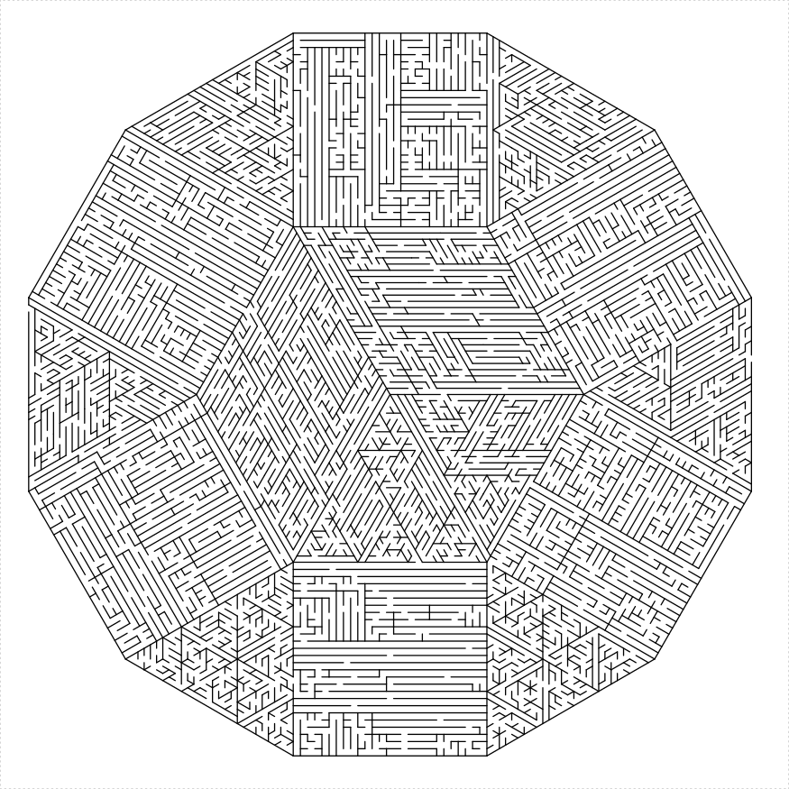
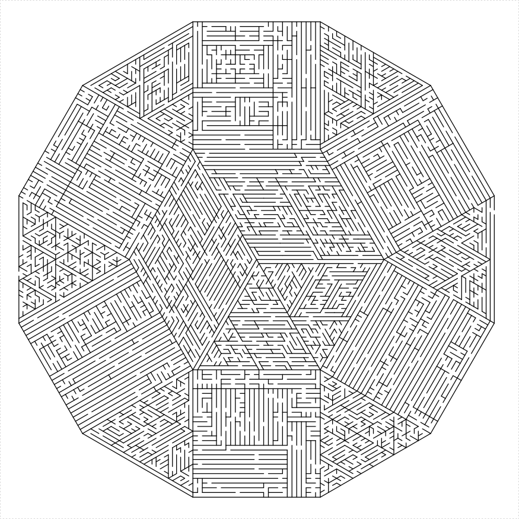

# Rhombic Dissections


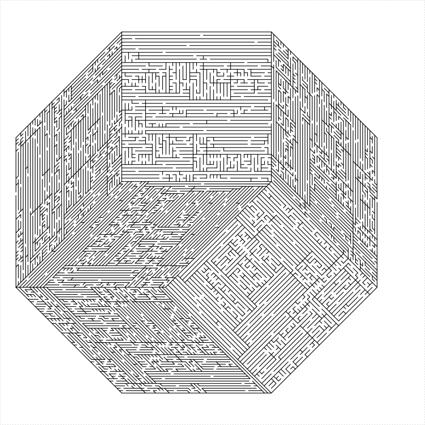

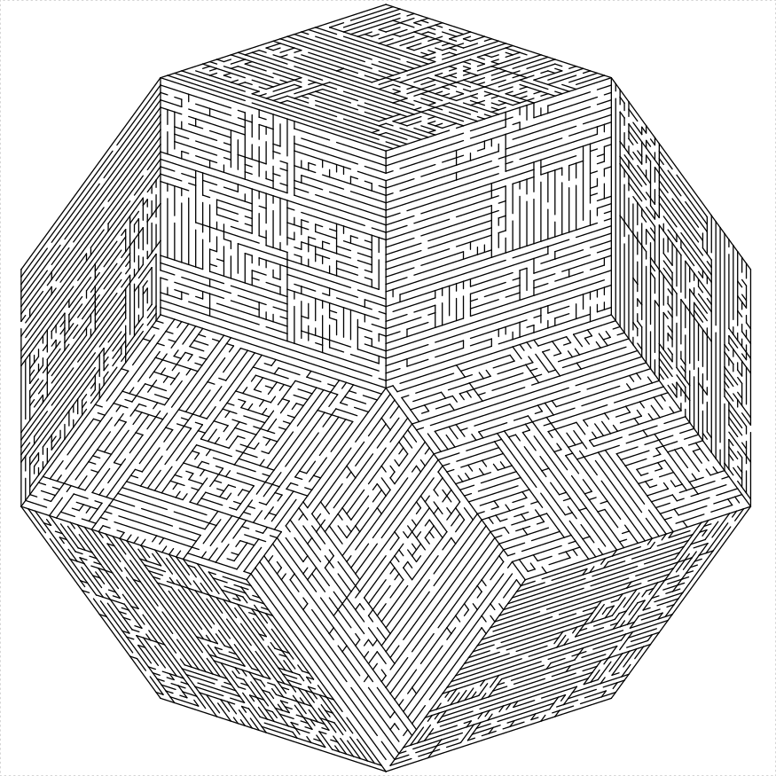

## Koch snowflake maze


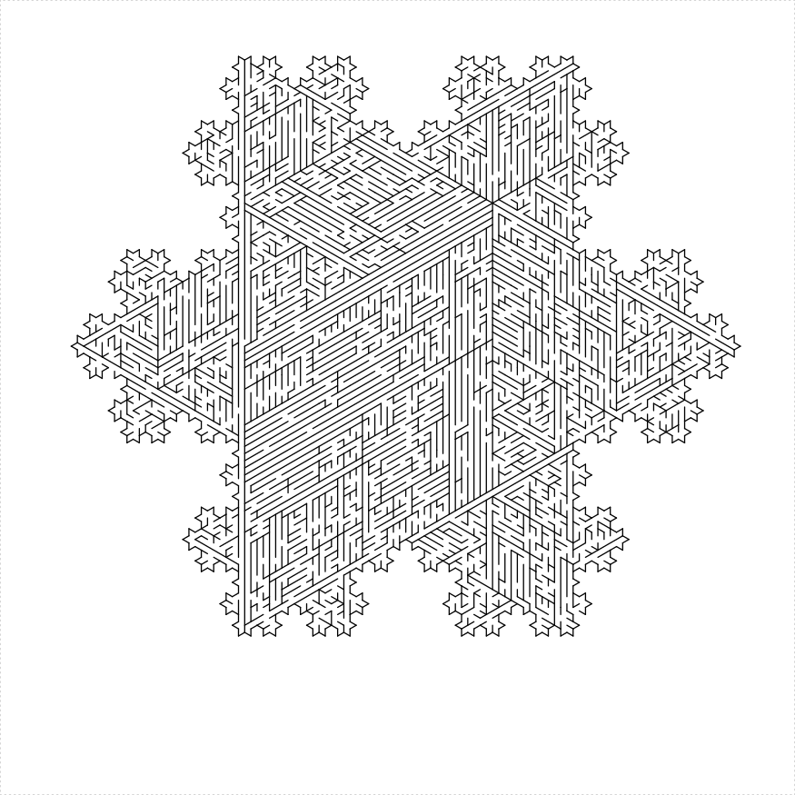

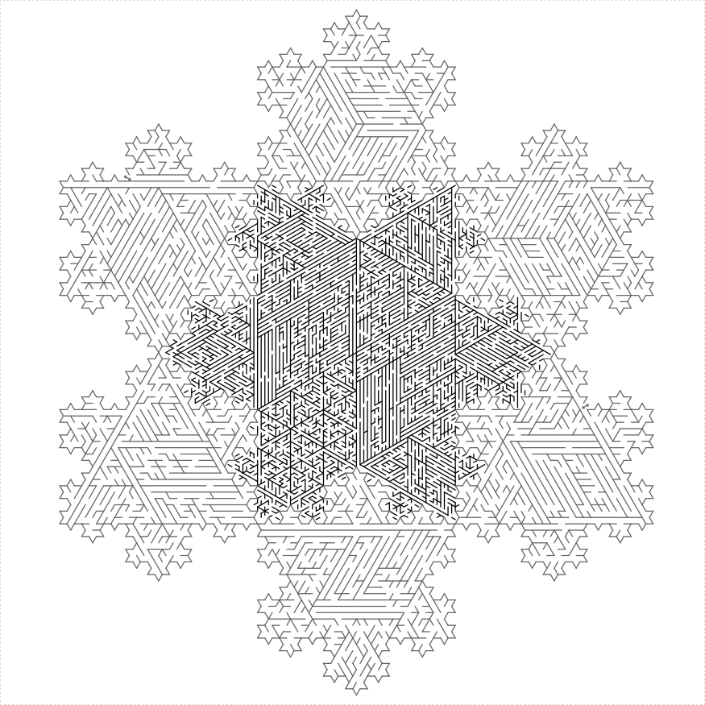

## Sierpinski Triangle


```r
library(TurtleGraphics)
library(mazealls)
turtle_init(2500, 2500, mode = "clip")
turtle_up()
turtle_hide()
turtle_do({
    turtle_setpos(50, 1250)
    turtle_setangle(0)
    sierpinski_maze(unit_len = 19, depth = 7, draw_boundary = TRUE, 
        boundary_lines = TRUE, boundary_holes = c(1, 
            3), color1 = "black", color2 = "gray60")
})
```

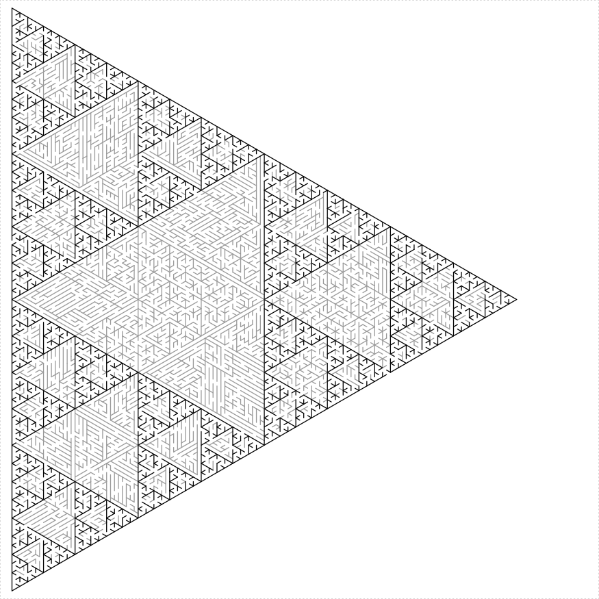

### Sierpinski Carpet


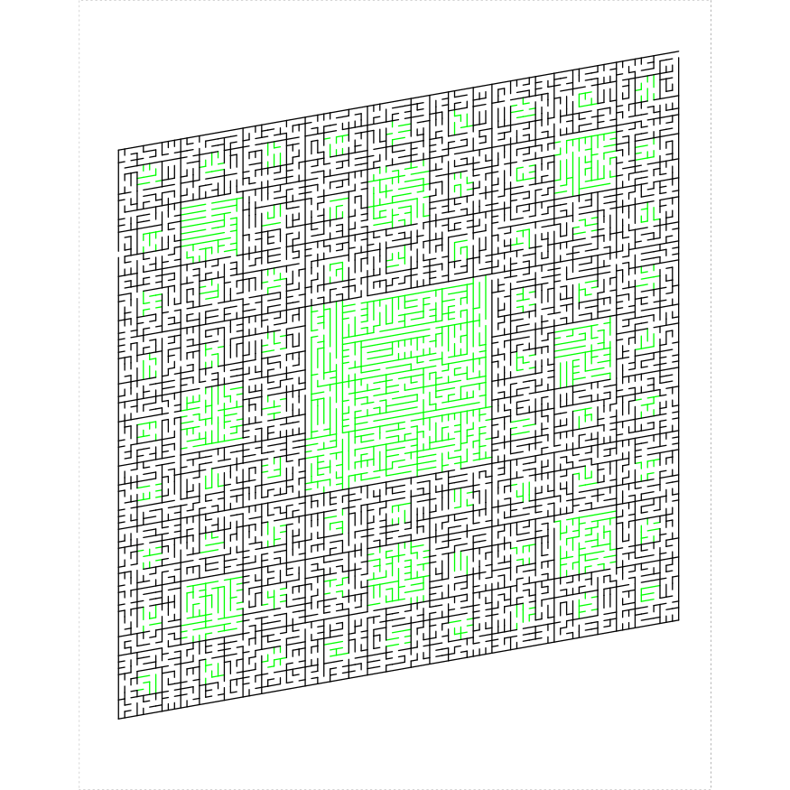

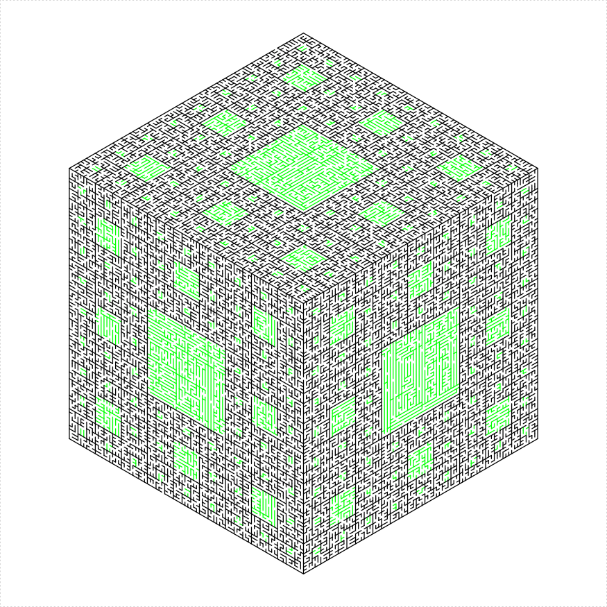

### Sierpinski Hexagon


```
## Error in sierpinski_hexagon_maze(depth = 6, unit_len = 9, boundary_lines = TRUE, : could not find function "sierpinski_hexagon_maze"
```


## Hexaflake 

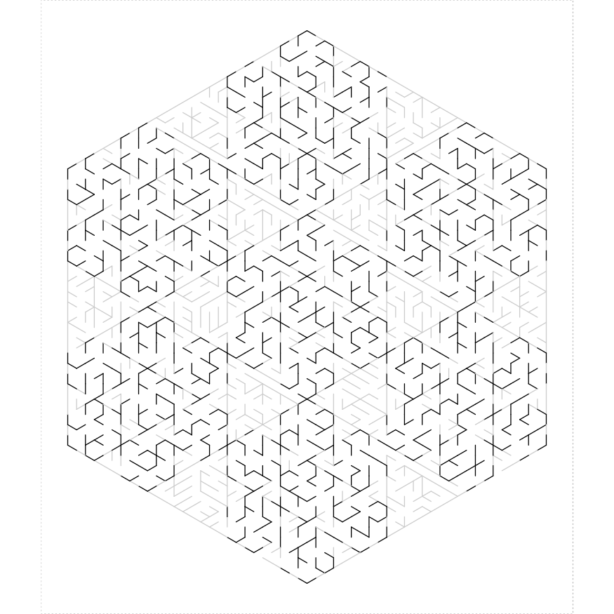


## A rectangular spiral

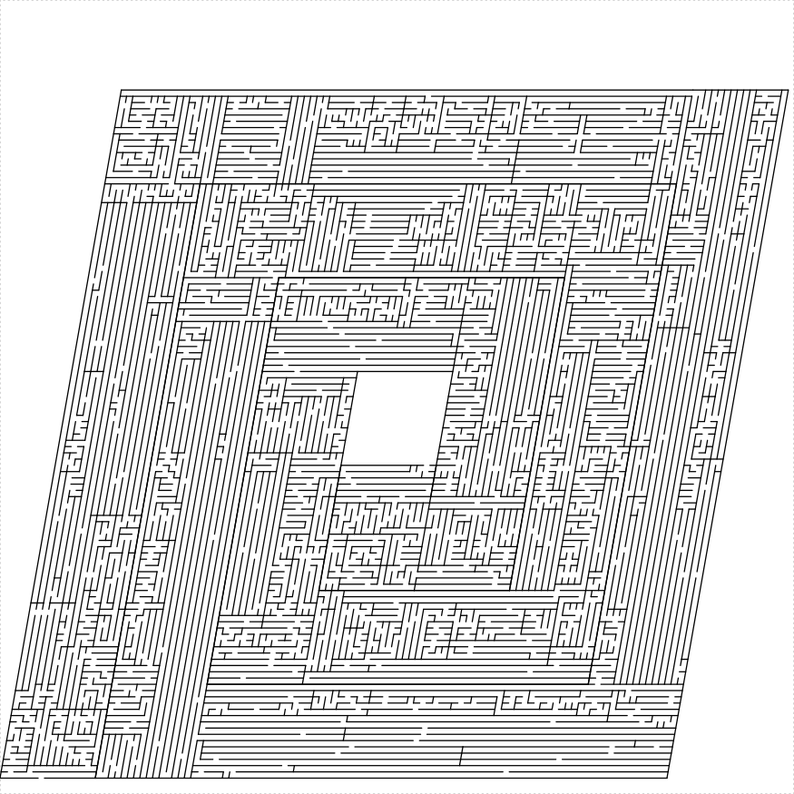


## A double rectangular spiral

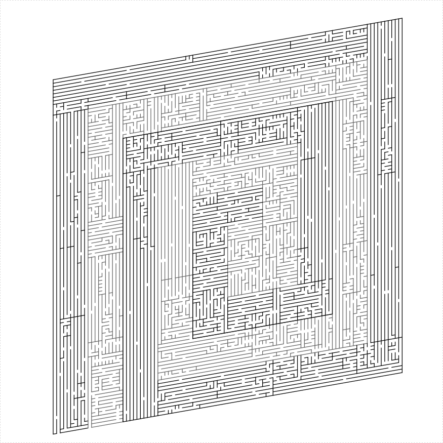


## A boustrophedon


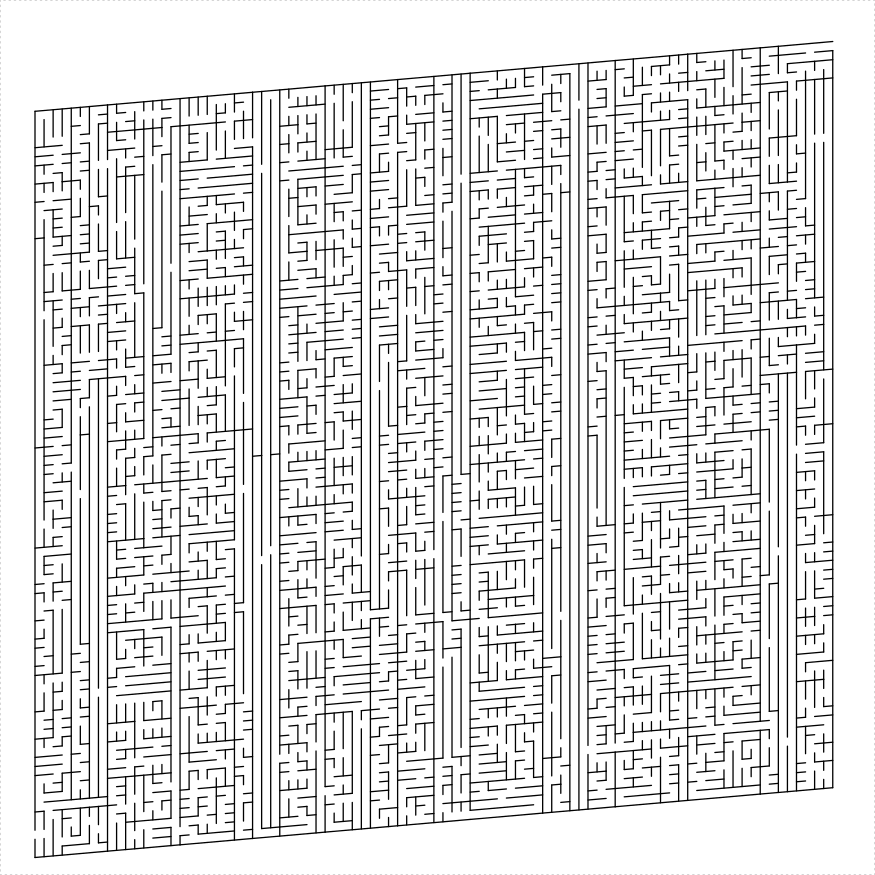

