# mazealls

[](https://travis-ci.org/shabbychef/mazealls)
[](http://codecov.io/github/shabbychef/mazealls?branch=master)
[](https://cran.r-project.org/package=mazealls)
[](http://www.r-pkg.org/pkg/mazealls)
[](http://www.r-pkg.org/pkg/mazealls)
[](http://www.rdocumentation.org/packages/mazealls)
[](https://www.gnu.org/licenses/lgpl-3.0)

> *Sometimes magic is just someone spending more time on something than anyone else might reasonably expect.* -- Teller
	

Generate mazes recursively via Turtle graphics. 

-- Steven E. Pav, shabbychef@gmail.com

## Installation

This package can be installed 
from CRAN, 
via [drat](https://github.com/eddelbuettel/drat "drat"), or
from github:


```r
# via CRAN:
install.packages("mazealls")
# via drat:
if (require(drat)) {
    drat:::add("shabbychef")
    install.packages("mazealls")
}
# get snapshot from github (may be buggy)
if (require(devtools)) {
    install_github("shabbychef/mazealls")
}
```

# parallelogram maze

The simplest maze to generate recursively is a parallelogram. One can generate
a parallelogram maze by splitting the domain into two parts by an arbitrary
cut line with a hole in it, and then recursively creating mazes on both parts. 
Unlike some shapes, this method applies for arbitrary (integral) side lengths,
where by 'length' we mean in units of 'hallway widths', what we call the
`unit_len` in the API. Here is a simple parallelogram maze:


```r
library(TurtleGraphics)
library(mazealls)
turtle_init(1000, 1000)
turtle_up()
turtle_hide()
turtle_do({
    turtle_left(90)
    turtle_forward(distance = 400)
    turtle_right(90)
    parallelogram_maze(angle = 90, unit_len = 10, width = 75, 
        height = 55, method = "uniform", draw_boundary = TRUE)
})
```


The `parallelogram_maze` function admits a `balance` parameter which controls
how the maze should be recursively subdivided. A negative value creates
imbalanced mazes, while positive values create more uniform mazes. In the
example below we create seven mazes side by side with an increasing balance
parameter:


```r
library(TurtleGraphics)
library(mazealls)
turtle_init(2000, 2000)
turtle_hide()
turtle_up()
turtle_do({
    turtle_left(90)
    turtle_forward(930)
    turtle_right(90)
    valseq <- seq(from = -1.5, to = 1.5, length.out = 7)
    blines <- c(1, 2, 3, 4)
    bholes <- c(1, 3)
    set.seed(1234)
    for (iii in seq_along(valseq)) {
        parallelogram_maze(angle = 90, unit_len = 12, 
            width = 22, height = 130, method = "two_parallelograms", 
            draw_boundary = TRUE, balance = valseq[iii], 
            end_side = 3, boundary_lines = blines, 
            boundary_holes = bholes)
        turtle_right(180)
        blines <- c(2, 3, 4)
        bholes <- c(3)
    }
})
```

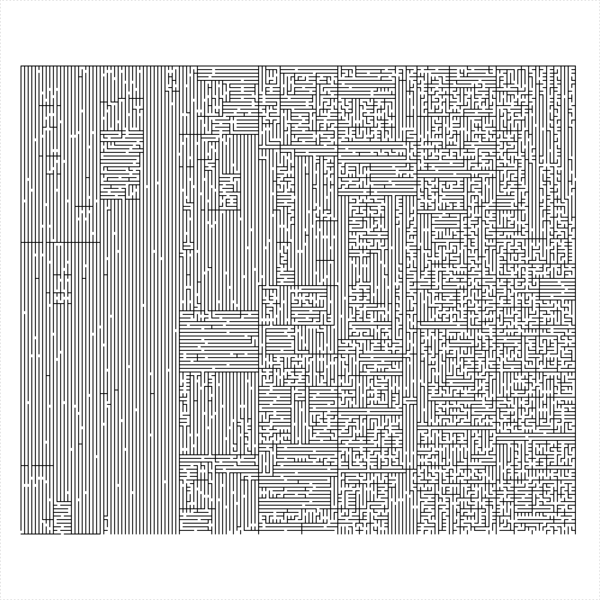

# triangle maze

An equilateral triangle maze can be constructed in a number of different ways:

1. Create four equilateral mazes with lines with holes between them. This
only works if the side length of the original is a power of two.
1. Cut out a parallelogram and attach two equilateral triangles.
Again only if the side length is a power of two.
1. Create an isosceles trapezoid maze, then stack an equilateral triangle
on top of it. This only works if the side length is even.
1. Create a regular hexagonal maze and three equilateral mazes in the corners.
This only works if the side length of the original triangle is divisible by
three.
1. Shave off a single hallway and create an equilateral triangular maze
of side length one less than the original.


I illustrate them here:


```r
library(TurtleGraphics)
library(mazealls)
# uniform method
turtle_init(1000, 1000)
turtle_up()
turtle_hide()
turtle_do({
    turtle_left(90)
    turtle_forward(distance = 300)
    turtle_right(90)
    eq_triangle_maze(depth = 6, unit_len = 12, method = "uniform", 
        draw_boundary = TRUE)
})
```

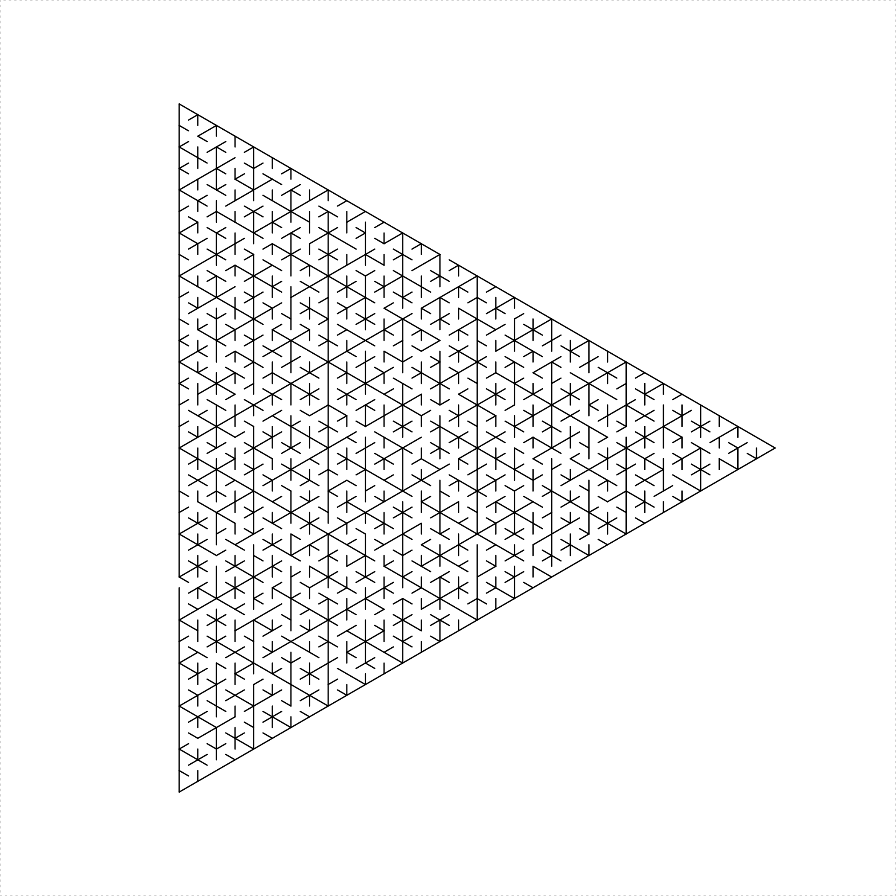


```r
library(TurtleGraphics)
library(mazealls)
# stacked trapezoids
turtle_init(1000, 1000)
turtle_up()
turtle_hide()
turtle_do({
    turtle_left(90)
    turtle_forward(distance = 300)
    turtle_right(90)
    eq_triangle_maze(depth = 6, unit_len = 12, method = "stack_trapezoids", 
        draw_boundary = TRUE)
})
```

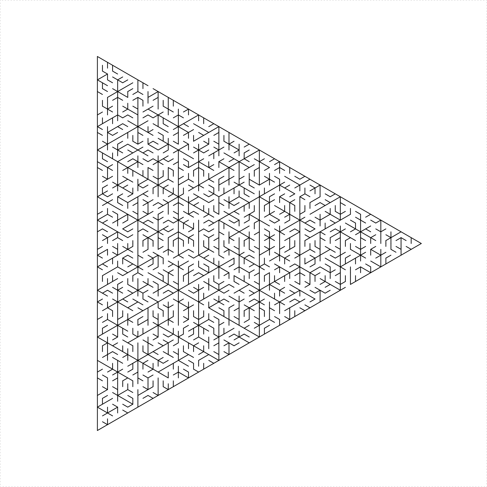


```r
library(TurtleGraphics)
library(mazealls)
# four triangles
turtle_init(1000, 1000)
turtle_up()
turtle_hide()
turtle_do({
    turtle_left(90)
    turtle_forward(distance = 300)
    turtle_right(90)
    eq_triangle_maze(depth = 6, unit_len = 12, method = "triangles", 
        draw_boundary = TRUE)
})
```

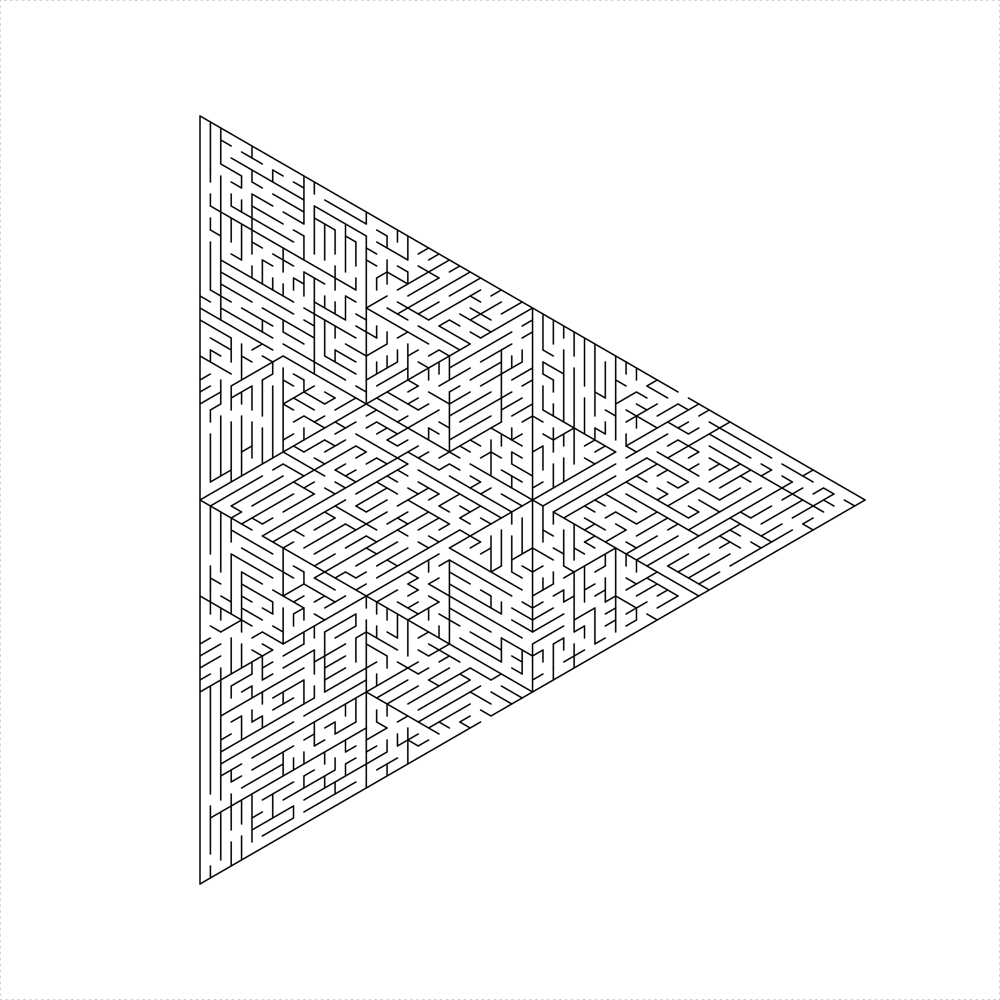

```r
library(TurtleGraphics)
library(mazealls)
# two ears
turtle_init(1000, 1000)
turtle_up()
turtle_hide()
turtle_do({
    turtle_left(90)
    turtle_forward(distance = 300)
    turtle_right(90)
    eq_triangle_maze(depth = 6, unit_len = 12, method = "two_ears", 
        draw_boundary = TRUE)
})
```

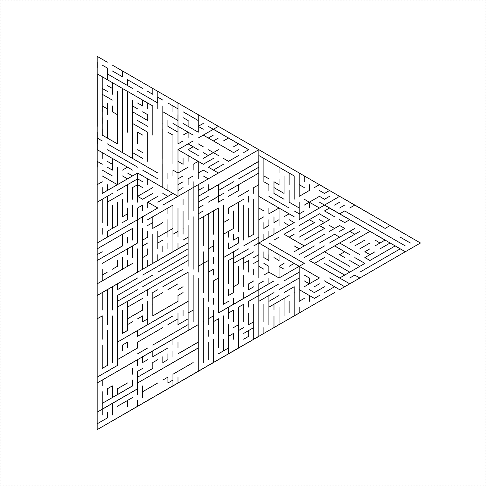


```r
library(TurtleGraphics)
library(mazealls)
# hex and three
turtle_init(1000, 1000)
turtle_up()
turtle_hide()
turtle_do({
    turtle_left(90)
    turtle_forward(distance = 300)
    turtle_right(90)
    eq_triangle_maze(depth = log2(66), unit_len = 12, 
        method = "hex_and_three", draw_boundary = TRUE)
})
```

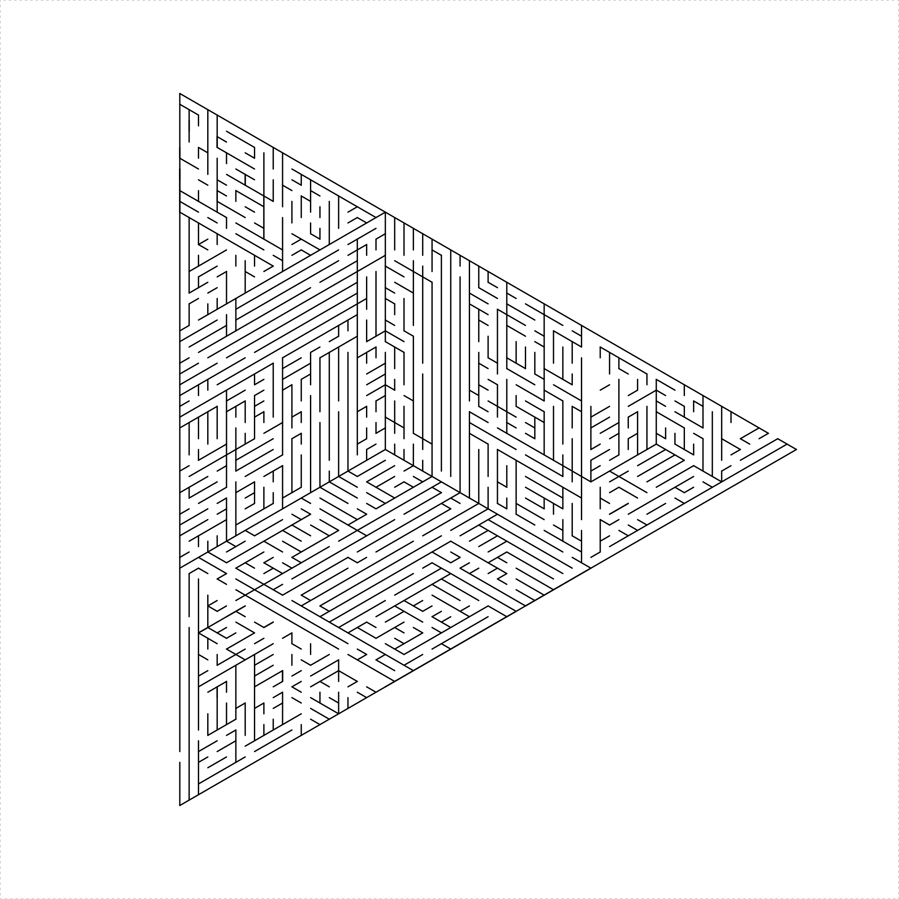


```r
library(TurtleGraphics)
library(mazealls)
# shave
turtle_init(1000, 1000)
turtle_up()
turtle_hide()
turtle_do({
    turtle_left(90)
    turtle_forward(distance = 300)
    turtle_right(90)
    eq_triangle_maze(depth = log2(66), unit_len = 12, 
        method = "shave", draw_boundary = TRUE)
})
```

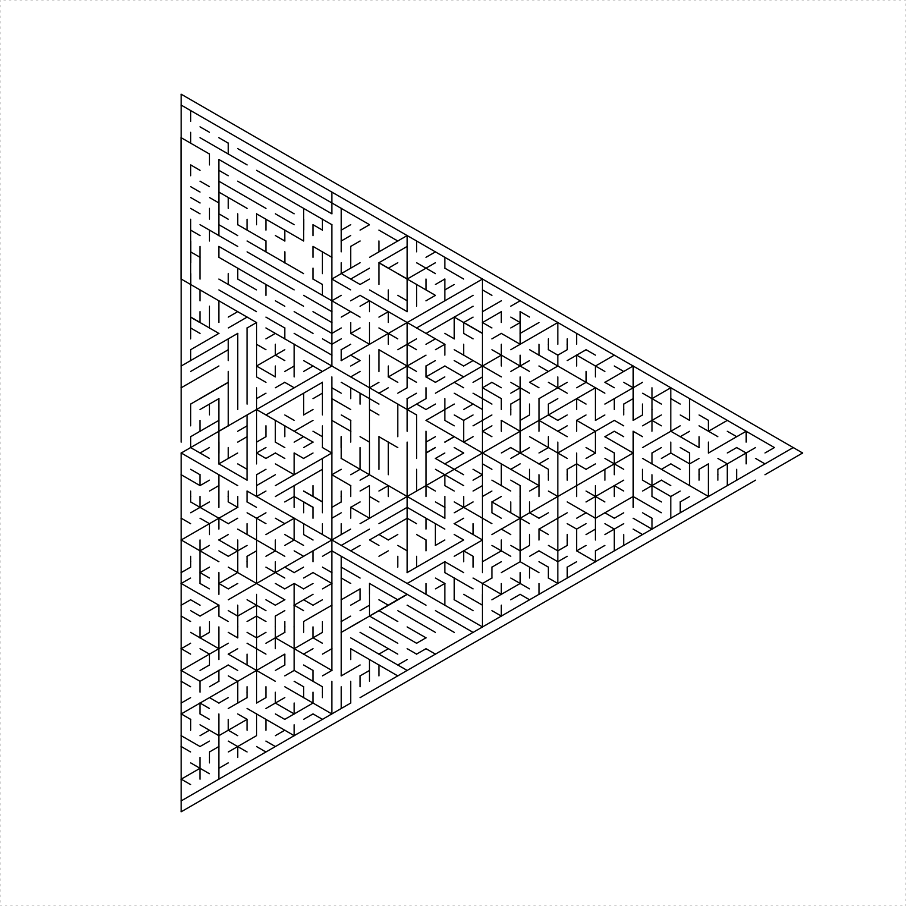


```r
library(TurtleGraphics)
library(mazealls)
# shave all
turtle_init(1000, 1000)
turtle_up()
turtle_hide()
turtle_do({
    turtle_left(90)
    turtle_forward(distance = 300)
    turtle_right(90)
    eq_triangle_maze(depth = log2(66), unit_len = 12, 
        method = "shave_all", draw_boundary = TRUE, 
        boustro = c(35, 2))
})
```

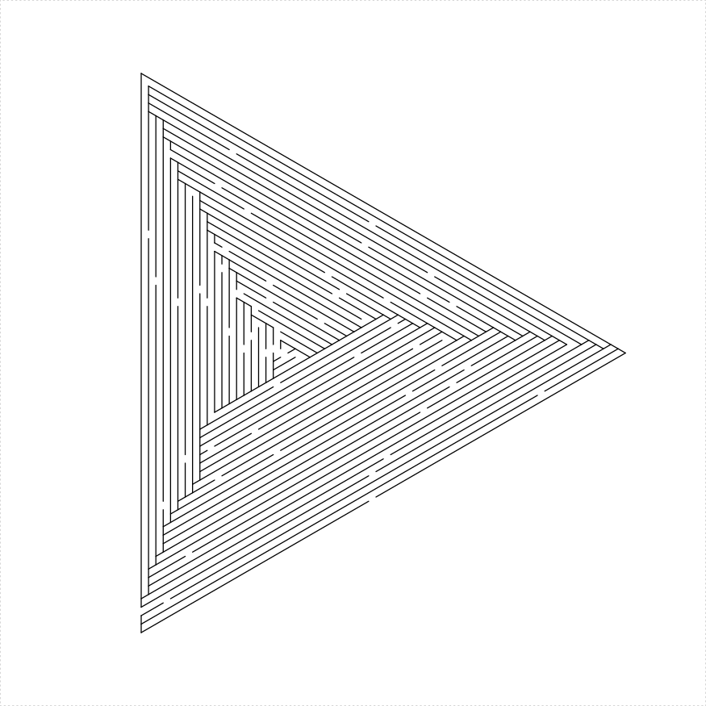

# hexagon maze


An regular hexagonal maze can be constructed in a number of different ways:

1. Decompose the hexagon as 6 equilateral triangle mazes, with one solid line
	 and five lines with holes dividing them.
1. Create two isosceles trapezoid mazes with long sides joined by a line with a
	 hole.
1. Create three parallelogram mazes with one solid line and two lines with
	 holes dividing them.


```r
library(TurtleGraphics)
library(mazealls)
# two trapezoids
turtle_init(1000, 1000)
turtle_up()
turtle_hide()
turtle_do({
    turtle_left(90)
    turtle_forward(distance = 300)
    turtle_right(90)
    hexagon_maze(depth = 5, unit_len = 12, method = "two_trapezoids", 
        draw_boundary = TRUE)
})
```

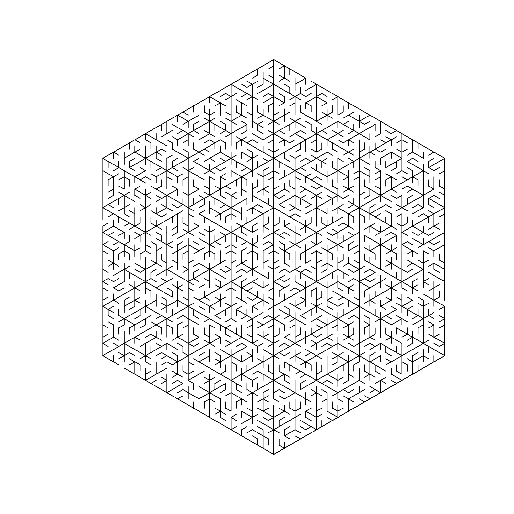


```r
library(TurtleGraphics)
library(mazealls)
# six triangles
turtle_init(1000, 1000)
turtle_up()
turtle_hide()
turtle_do({
    turtle_left(90)
    turtle_forward(distance = 300)
    turtle_right(90)
    hexagon_maze(depth = 5, unit_len = 12, method = "six_triangles", 
        draw_boundary = TRUE, boundary_hole_arrows = TRUE)
})
```

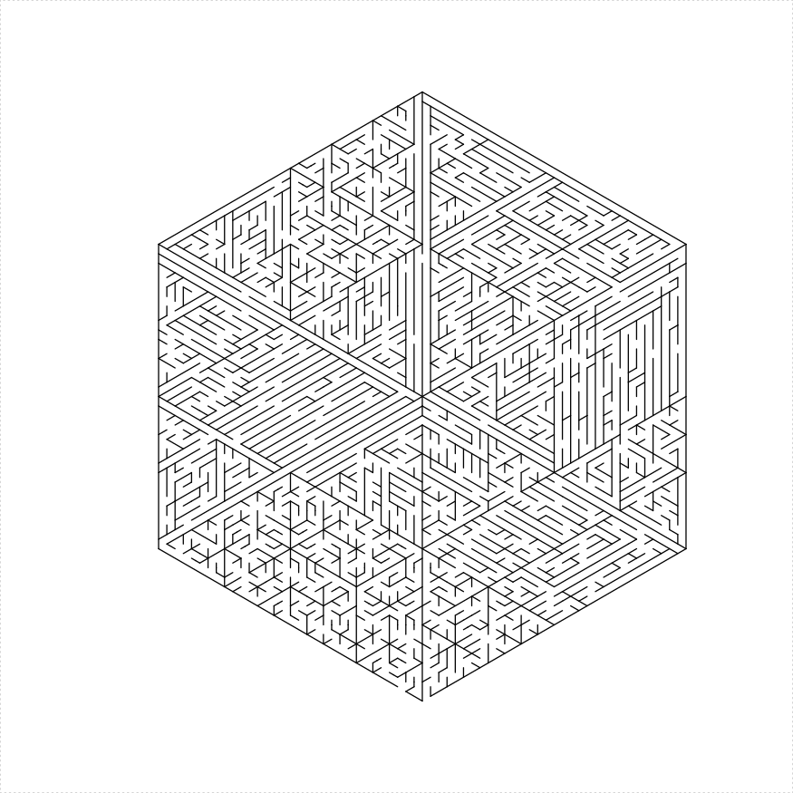


```r
library(TurtleGraphics)
library(mazealls)
# six triangles
turtle_init(1000, 1000)
turtle_up()
turtle_hide()
turtle_do({
    turtle_left(90)
    turtle_forward(distance = 300)
    turtle_right(90)
    hexagon_maze(depth = 5, unit_len = 12, method = "three_parallelograms", 
        draw_boundary = TRUE, boundary_hole_arrows = TRUE)
})
```

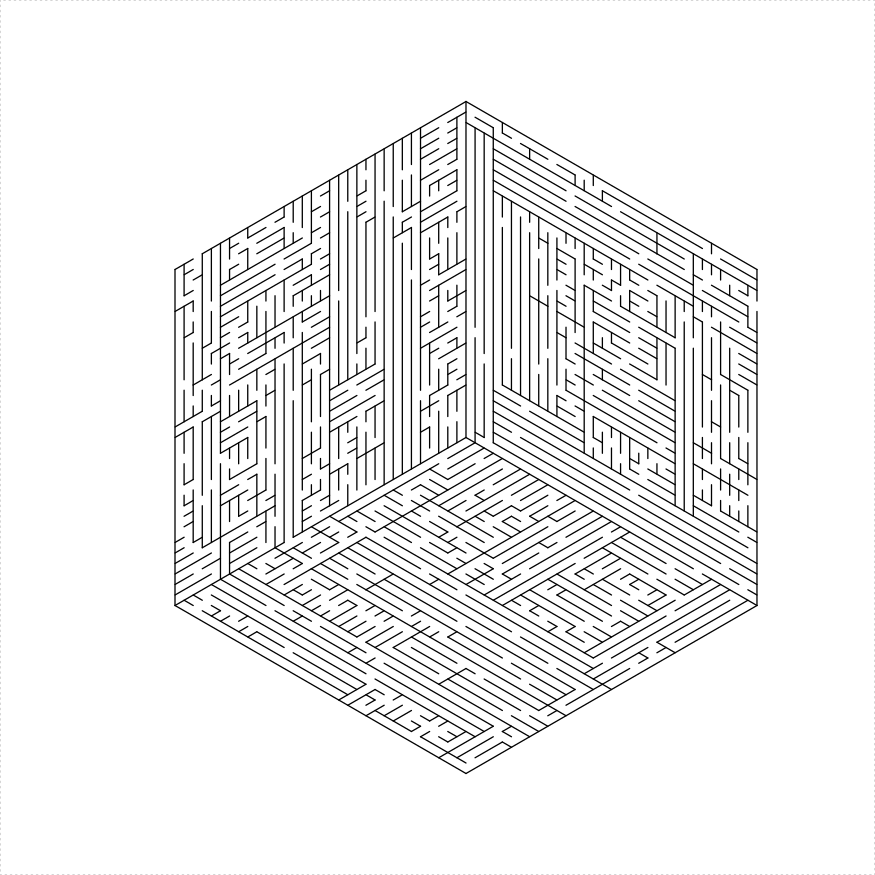

# dodecagon maze

A dodecagon can be dissected into a hexagon and a ring of alternating
squares and equilateral triangles:


```r
library(TurtleGraphics)
library(mazealls)
# dodecagon
turtle_init(2200, 2200, mode = "clip")
turtle_hide()
turtle_up()
turtle_do({
    turtle_setpos(80, 1100)
    turtle_setangle(0)
    dodecagon_maze(depth = log2(27), unit_len = 20, 
        draw_boundary = TRUE, boundary_holes = c(1, 
            7))
})
```

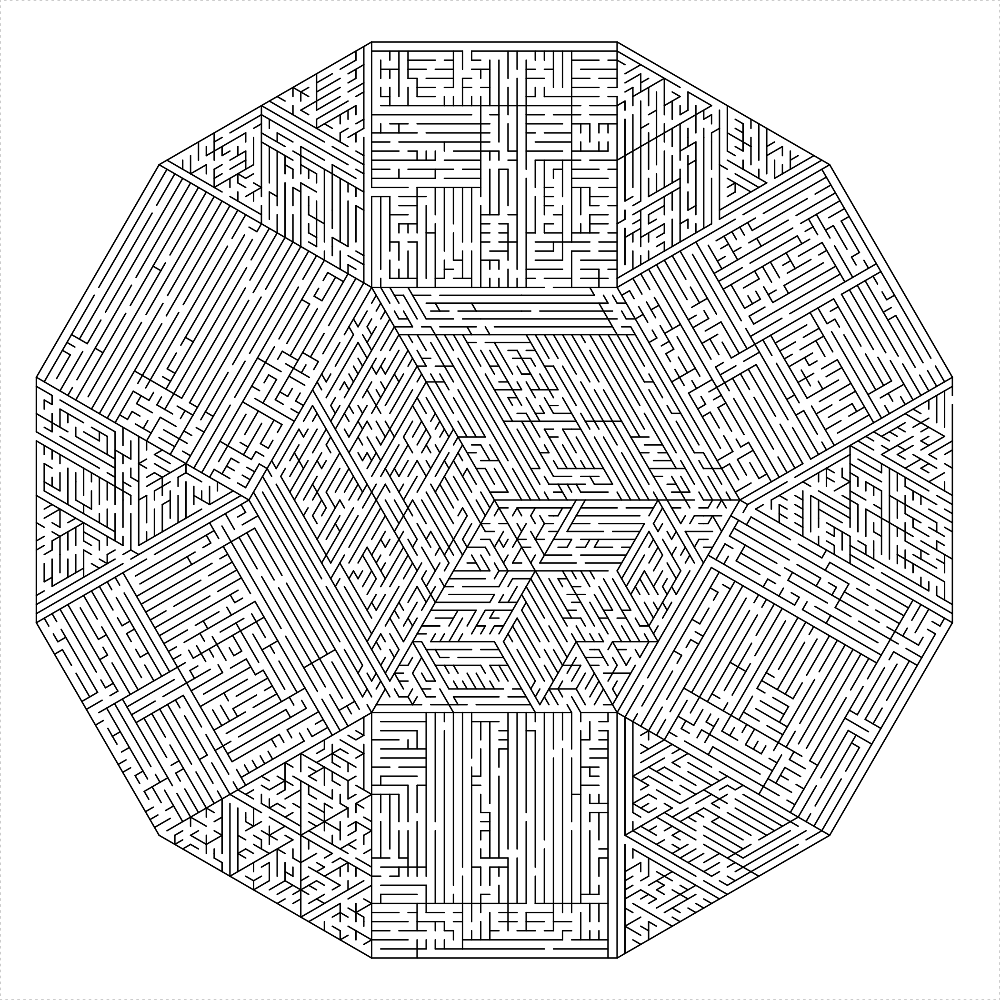

# trapezoid maze


An isosceles trapezoid maze can be constructed in a number of different ways:

1. Decompose as four trapezoidal mazes with a 'bone' shape between them
	 consisting of two solid lines and three lines with holes.
1. Decompose as a parallelogram and an equilateral triangle with a line
	 with holes between them


```r
library(TurtleGraphics)
library(mazealls)
# four trapezoids
turtle_init(1000, 1000)
turtle_up()
turtle_hide()
turtle_do({
    turtle_left(90)
    turtle_forward(distance = 300)
    turtle_right(90)
    iso_trapezoid_maze(depth = 5, unit_len = 12, method = "four_trapezoids", 
        draw_boundary = TRUE)
})
```

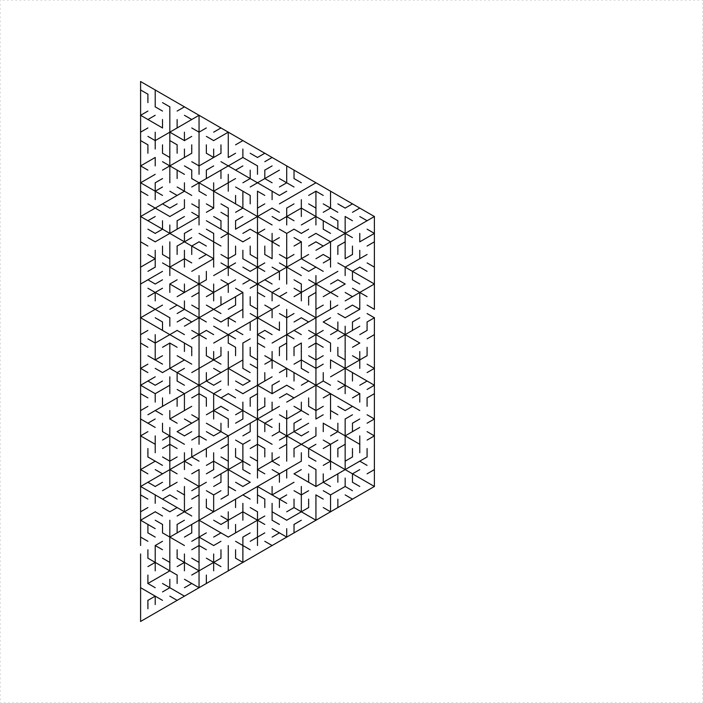


```r
library(TurtleGraphics)
library(mazealls)
# one ear
turtle_init(1000, 1000)
turtle_up()
turtle_hide()
turtle_do({
    turtle_left(90)
    turtle_forward(distance = 300)
    turtle_right(90)
    iso_trapezoid_maze(depth = 5, unit_len = 12, method = "one_ear", 
        draw_boundary = TRUE)
})
```

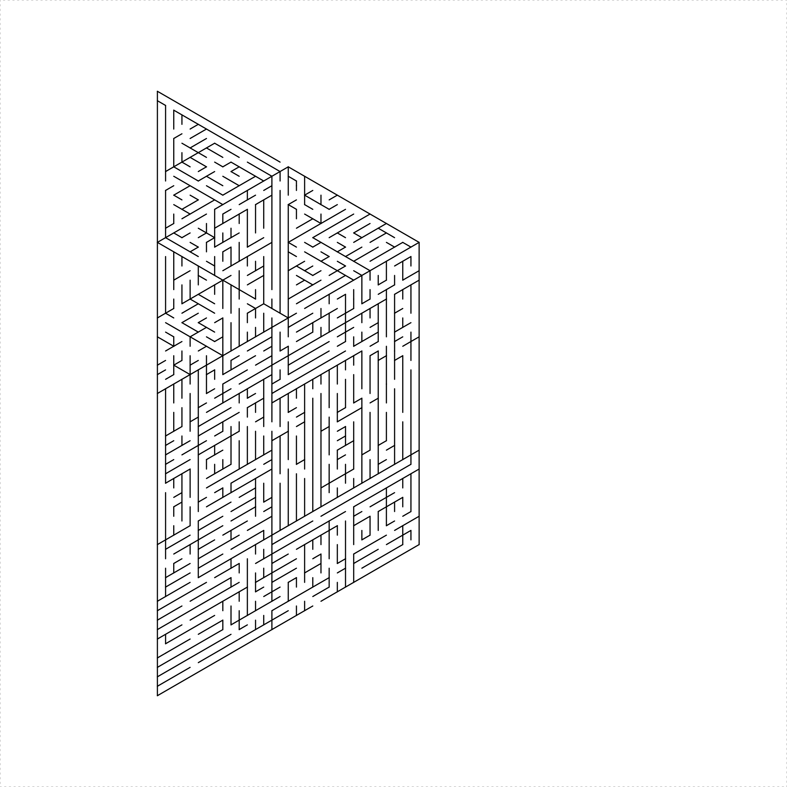

# Rhombic Dissections

Regular _2n_ gons usually admit a dissection into rhombuses. Sometimes,
however, these have extremely acute angles, which do not translate into nice
mazes. At the moment, there is only support for octagons, and decagons. While
a dodecagon would also admit such a dissection, this would require extremely
acute angles which would make an ugly maze.


```r
library(TurtleGraphics)
library(mazealls)
# octagon
turtle_init(2000, 2000, mode = "clip")
turtle_hide()
turtle_up()
turtle_do({
    turtle_setpos(75, 1000)
    turtle_setangle(0)
    octagon_maze(log2(48), 16, draw_boundary = TRUE, 
        boundary_holes = c(1, 5))
})
```

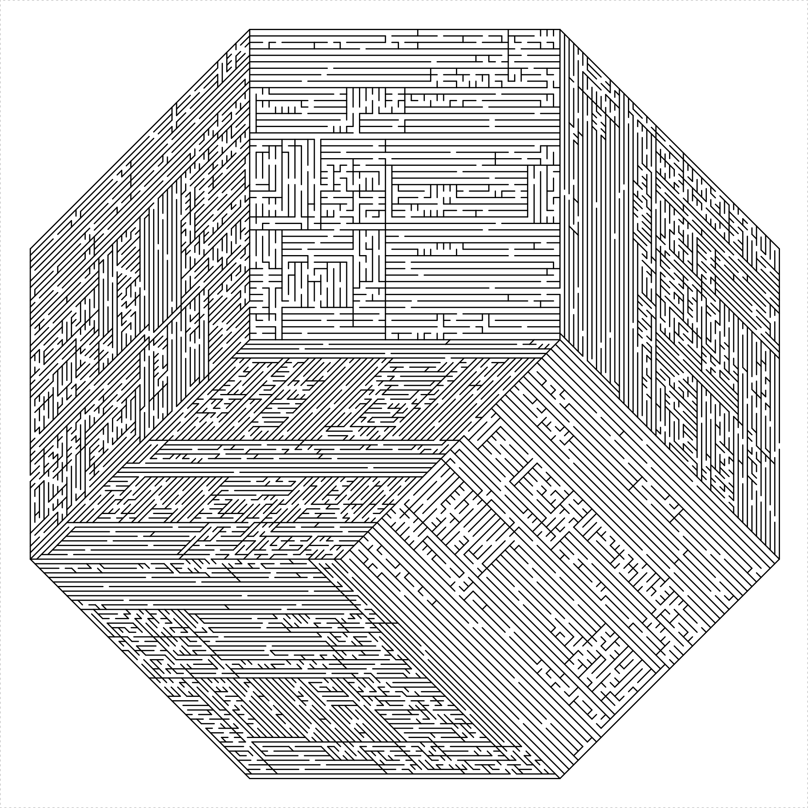


```r
library(TurtleGraphics)
library(mazealls)
# decagon
turtle_init(2200, 2200, mode = "clip")
turtle_hide()
turtle_up()
turtle_do({
    turtle_setpos(60, 1100)
    turtle_setangle(0)
    decagon_maze(5, 21, draw_boundary = TRUE, boundary_holes = c(1, 
        6))
})
```

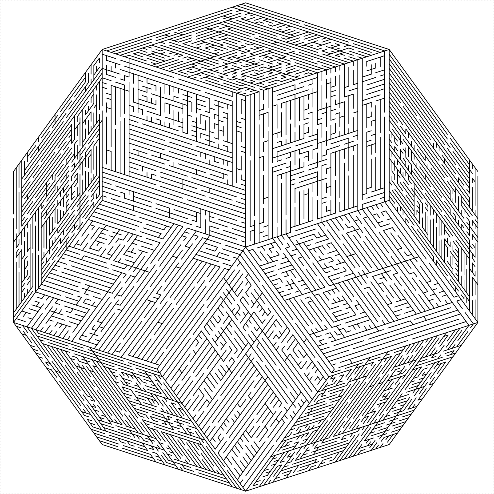

# Fractal mazes

## Koch snowflake maze

Everyone's favorite snowflake can also be a maze. Simply fill in triangle bumps
with triangular mazes and create lines with holes as needed:


```r
library(TurtleGraphics)
library(mazealls)
# koch flake
turtle_init(1000, 1000)
turtle_up()
turtle_hide()
turtle_do({
    turtle_left(90)
    turtle_forward(distance = 200)
    turtle_right(90)
    turtle_backward(distance = 300)
    koch_maze(depth = 4, unit_len = 8)
})
```

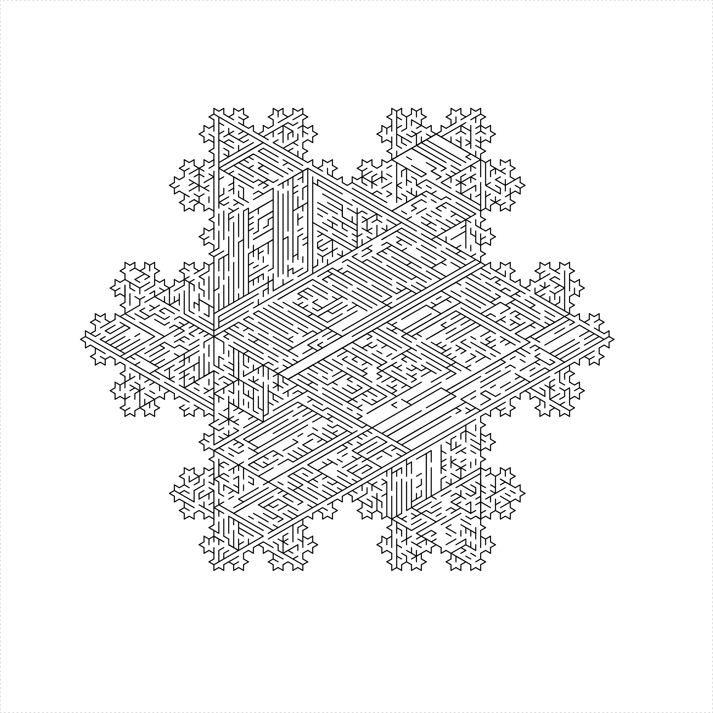

Koch flakes of different sizes tile the plane:


```r
library(TurtleGraphics)
library(mazealls)
# koch flake
turtle_init(2000, 2000, mode = "clip")
turtle_up()
turtle_hide()
turtle_do({
    turtle_setpos(450, 1000)
    turtle_setangle(60)
    ul <- 12
    dep <- 4
    koch_maze(depth = dep, unit_len = ul, clockwise = TRUE, 
        draw_boundary = FALSE)
    turtle_left(30)
    turtle_col("gray40")
    dropdown <- 1
    for (iii in c(1:6)) {
        if (iii == 1) {
            bholes <- c(1, 2)
        } else if (iii == 4) {
            bholes <- c(1, 3)
        } else {
            bholes <- c(1)
        }
        koch_maze(depth = dep - dropdown, unit_len = ul * 
            (3^(dropdown - 0.5)), clockwise = FALSE, 
            draw_boundary = TRUE, boundary_holes = bholes, 
            boundary_hole_arrows = c(2, 3))
        turtle_forward(3^(dep - 1) * ul * sqrt(3))
        turtle_right(60)
    }
})
```

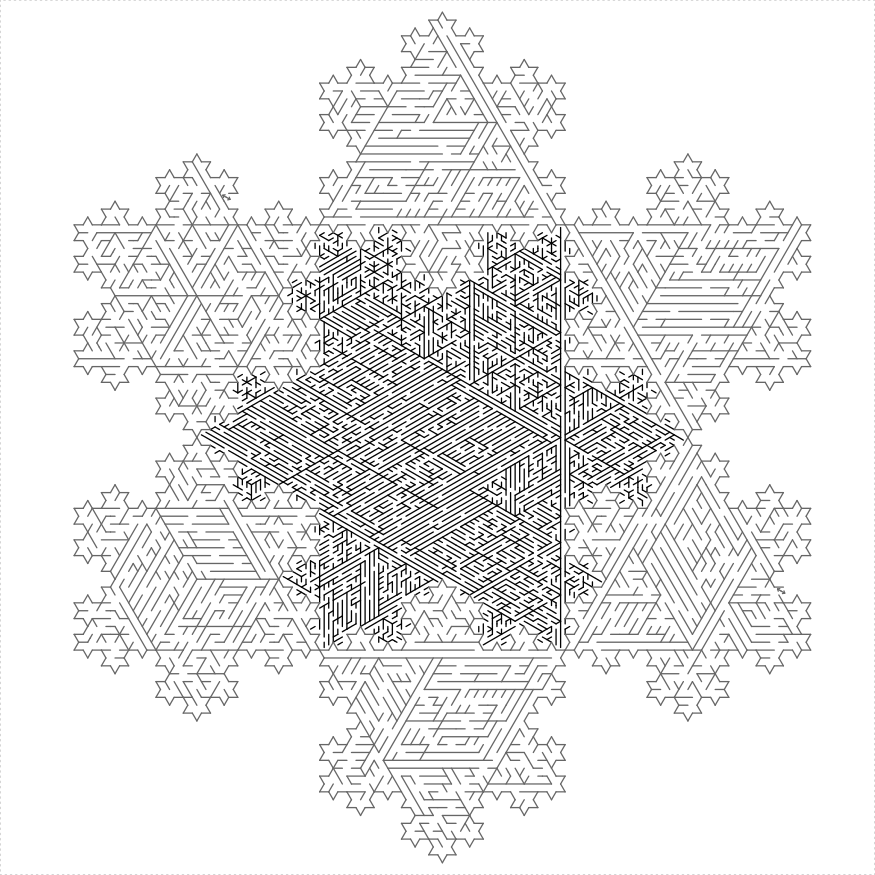

## Sierpinski Triangle

Similarly, one can construct a maze in a Sierpinski triangle.


```r
library(TurtleGraphics)
library(mazealls)
turtle_init(2500, 2500, mode = "clip")
turtle_up()
turtle_hide()
turtle_do({
    turtle_setpos(50, 1250)
    turtle_setangle(0)
    sierpinski_maze(unit_len = 19, depth = 7, draw_boundary = TRUE, 
        boundary_lines = TRUE, boundary_holes = c(1, 
            3), color1 = "black", color2 = "gray60")
})
```

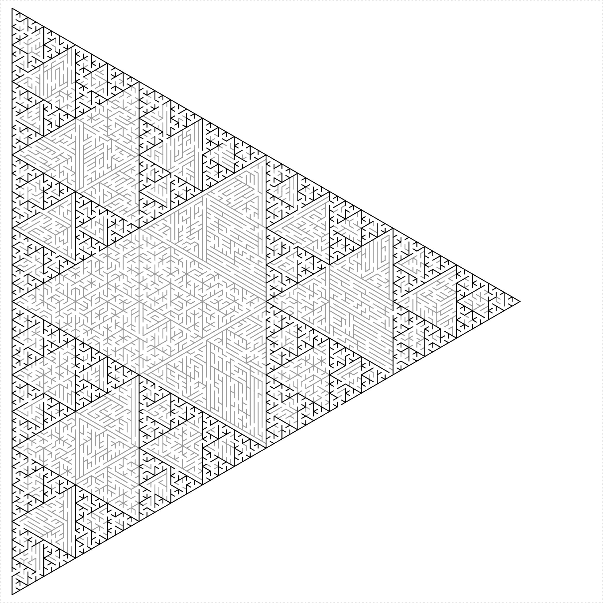

And a Sierpinski Carpet:


```r
library(TurtleGraphics)
library(mazealls)
turtle_init(800, 1000)
turtle_up()
turtle_hide()
turtle_do({
    turtle_setpos(50, 450)
    turtle_setangle(0)
    sierpinski_carpet_maze(angle = 80, unit_len = 8, 
        width = 90, height = 90, draw_boundary = TRUE, 
        boundary_holes = c(1, 3), balance = 1.5, color2 = "green")
})
```

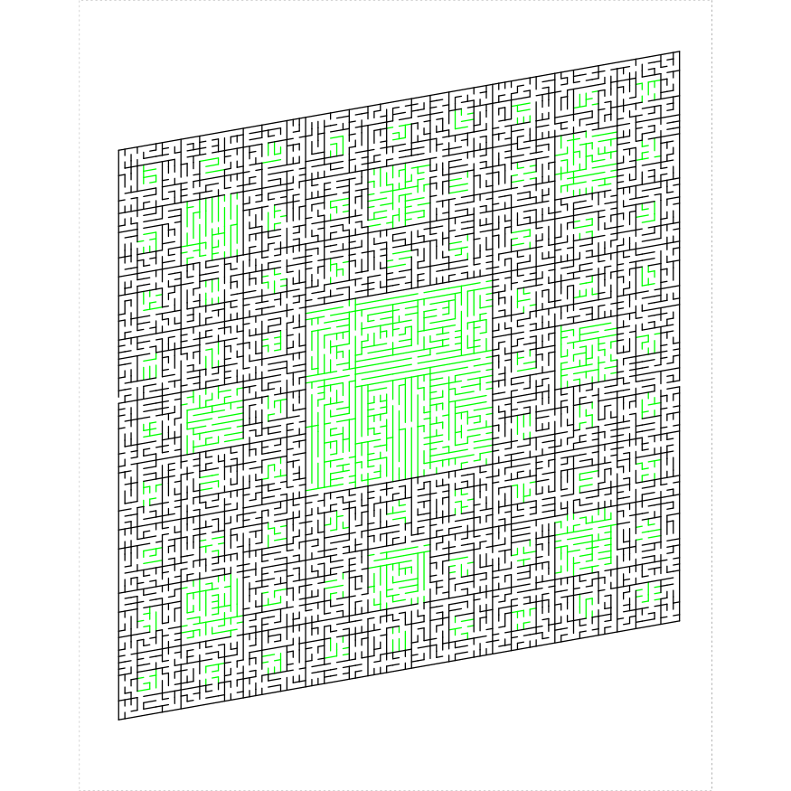


```r
library(TurtleGraphics)
library(mazealls)
turtle_init(2000, 2000, mode = "clip")
turtle_hide()
turtle_up()
bholes <- list(c(1, 2), c(1), c(2))
turtle_do({
    turtle_setpos(1000, 1000)
    turtle_setangle(180)
    for (iii in c(1:3)) {
        mybhol <- bholes[[iii]]
        sierpinski_carpet_maze(angle = 120, unit_len = 11, 
            width = 81, height = 81, draw_boundary = TRUE, 
            boundary_lines = c(1, 2, 3), num_boundary_holes = 0, 
            boundary_holes = mybhol, balance = 1, color2 = "green", 
            start_from = "corner")
        turtle_left(120)
    }
})
```

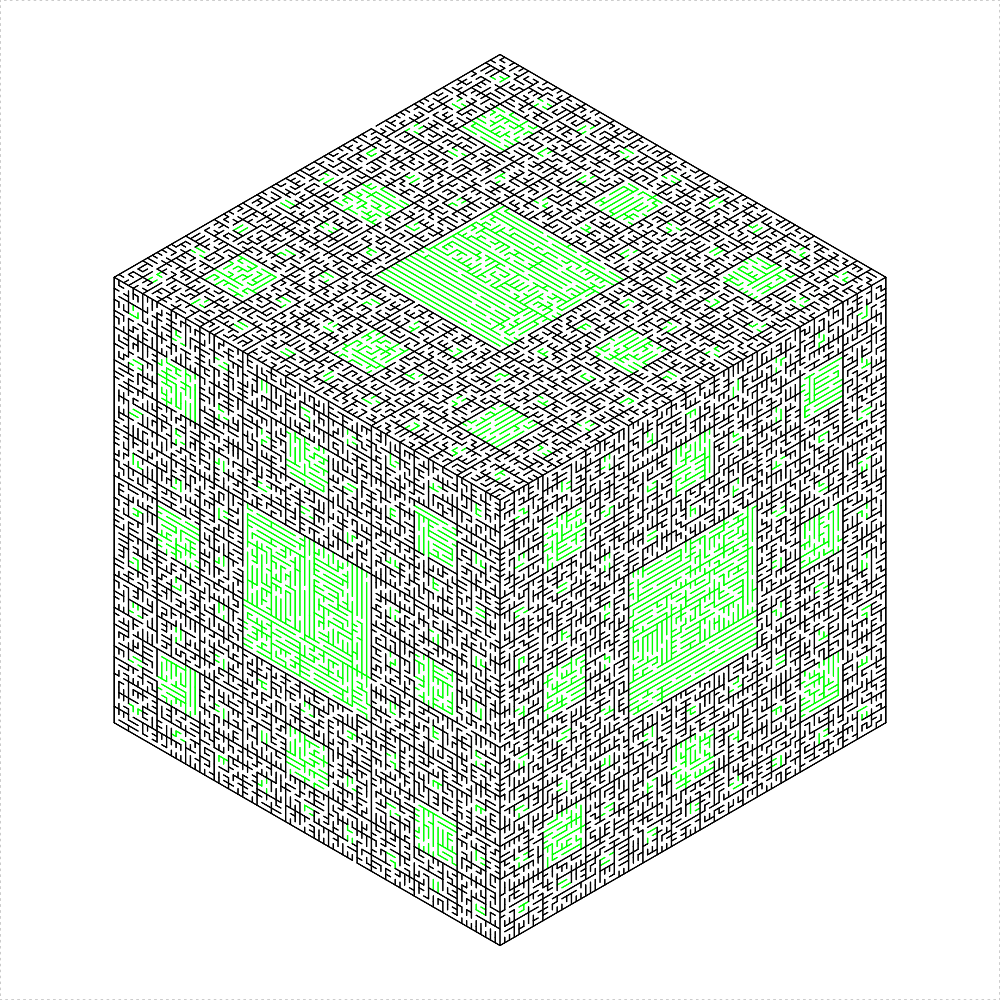

One can make four different kinds of Sierpinski trapezoids, the traditional
four triangles, a hexaflake, and something like a Dragon fractal:


```r
library(TurtleGraphics)
library(mazealls)
turtle_init(1050, 600, mode = "clip")
turtle_hide()
turtle_up()
turtle_do({
    for (iii in c(1:4)) {
        turtle_setpos(40 + (iii - 1) * 250, 300)
        turtle_setangle(0)
        sierpinski_trapezoid_maze(unit_len = 8, depth = 5, 
            draw_boundary = TRUE, start_from = "midpoint", 
            num_boundary_holes = 2, boundary_holes = c(2, 
                4), color2 = "green", flip_color_parts = iii)  # this controls fractal style
    }
})
```

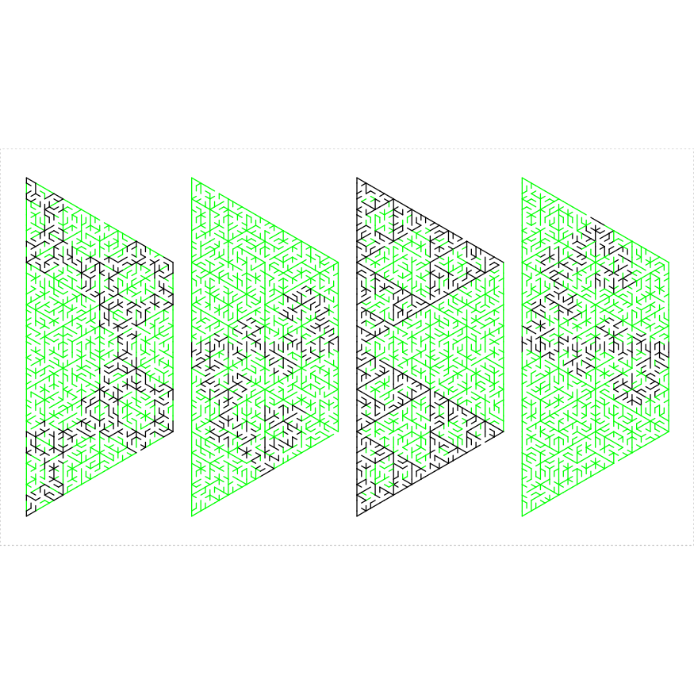


## Hexaflake 

A hexaflake is a cross between a Koch snowflake and a Sierpinski triangle, at
least in theory.


```r
library(TurtleGraphics)
library(mazealls)
# hexaflake
long_side <- 2400
inner_side <- long_side * sqrt(3)/2
sidelen <- long_side/2
dep <- 4
ul <- floor(sidelen/(3^dep))
true_wid <- 2 * ul * 3^dep * sqrt(3)/2

turtle_init(ceiling(1.1 * inner_side), ceiling(1.1 * 
    long_side), mode = "clip")
turtle_up()
turtle_hide()
turtle_do({
    turtle_setpos(0.5 * (ceiling(1.1 * inner_side) - 
        true_wid), 0.55 * long_side)
    turtle_setangle(0)
    hexaflake_maze(depth = dep, unit_len = floor(sidelen/(3^dep)), 
        draw_boundary = TRUE, color2 = "gray80")
})
```

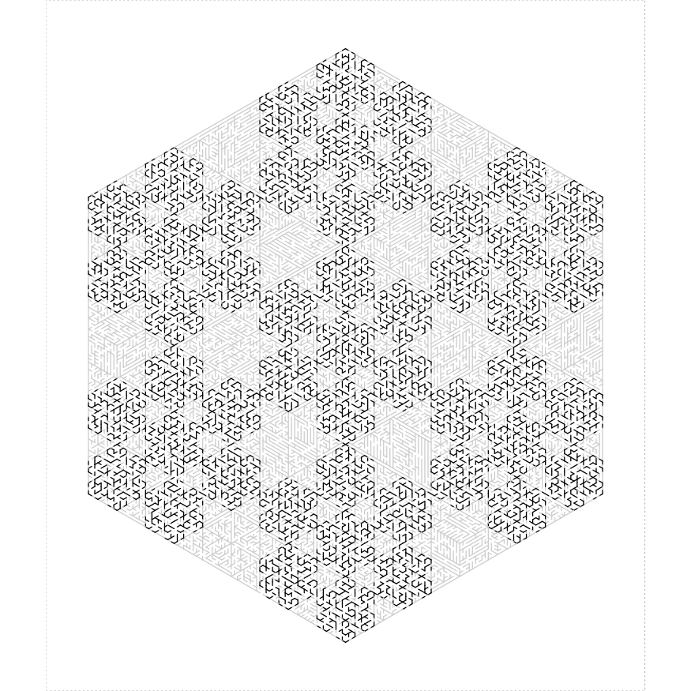

# Controls

## unit length

The `unit_len` parameter controls the graphical length of one 'unit', which is
the length of holes between sections of the mazes, and is roughly the width
of the 'hallways' of a maze. Here is an example of using different
unit lengths in a stack of trapezoids


```r
library(TurtleGraphics)
library(mazealls)
# stack some trapezoids with different unit_len
turtle_init(2500, 2500)
turtle_up()
turtle_hide()
turtle_do({
    turtle_left(90)
    turtle_forward(distance = 800)
    turtle_right(90)
    clockwise <- TRUE
    for (iii in c(1:6)) {
        iso_trapezoid_maze(depth = 5, unit_len = 2^(6 - 
            iii), method = "four_trapezoids", draw_boundary = TRUE, 
            clockwise = clockwise, end_side = 3, start_from = "midpoint", 
            boundary_lines = c(1, 2, 4), boundary_holes = c(1))
        clockwise <- !clockwise
    }
})
```

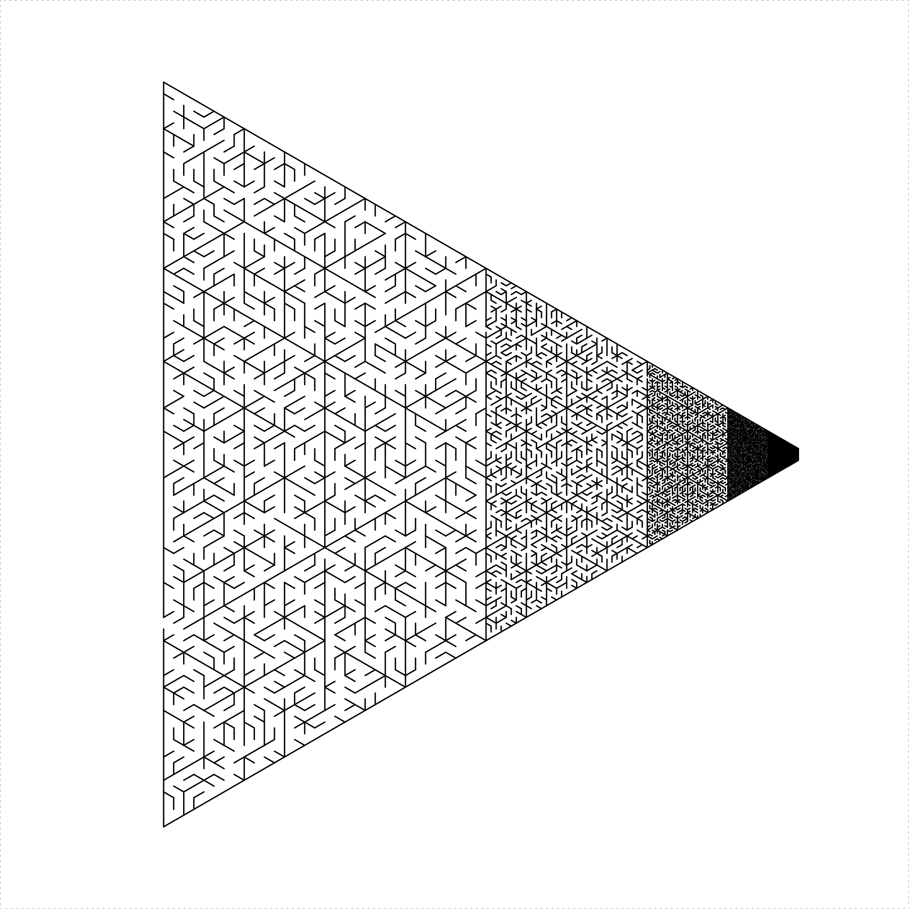

## boundaries

The parameters `draw_boundary`, `boundary_lines`, `boundary_holes`, `num_boundary_holes` and `boundary_hole_color` control
the drawing of the final outer boundary of polynomial mazes. Without a boundary
the maze can be used in recursive construction. Adding a boundary provides the
typical entry and exit points of a maze. The parameter `draw_boundary` is a
single Boolean that controls whether the boundary is drawn or not.
The parameter `boundary_lines` may be a scalar Boolean, or a numeric
array giving the indices of which sides should have drawn boundary lines.
The sides are numbered in the order in which they appear, and are
controlled by the `clockwise` parameter. The parameter `boundary_holes`
is a numeric array giving the indices of the boundary lines that should
have holes. If `NULL`, then we uniformly choose `num_boundary_holes` holes 
at random. Holes can be drawn as colored segments with the
`boundary_hole_color`, which is a character array giving the color of each
hole. The value 'clear' stands in for clear holes.


```r
library(TurtleGraphics)
library(mazealls)
# side by side
turtle_init(1000, 400)
turtle_up()
turtle_hide()
turtle_do({
    turtle_left(90)
    turtle_forward(distance = 450)
    turtle_right(90)
    
    parallelogram_maze(unit_len = 10, height = 25, 
        draw_boundary = FALSE, end_side = 3)
    
    turtle_left(90)
    turtle_forward(distance = 30)
    turtle_left(90)
    
    parallelogram_maze(unit_len = 10, height = 25, 
        draw_boundary = TRUE, boundary_lines = c(1, 
            3), boundary_holes = FALSE, end_side = 3)
    
    turtle_left(90)
    turtle_forward(distance = 30)
    turtle_left(90)
    
    parallelogram_maze(unit_len = 10, height = 25, 
        draw_boundary = TRUE, boundary_lines = c(2, 
            4), boundary_holes = c(2, 4), boundary_hole_color = c("ignore", 
            "green", "ignore", "blue"))
})
```

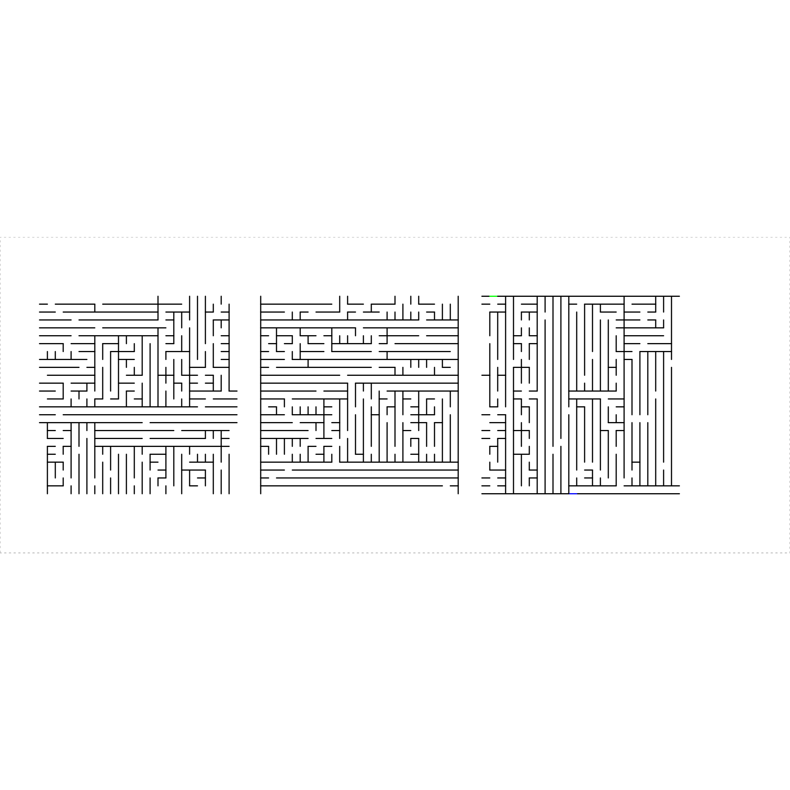

## end side

The `end_side` parameter controls which side of the maze the turtle ends on.
The default value of 1 essentially causes the turtle to end where it 
started. The sides are numbered in the order in which the boundary would be
drawn. Along with the boundary controls, the ending side can be useful to join together 
polygons into more complex mazes, as below:


```r
library(TurtleGraphics)
library(mazealls)
# triangle of hexes
turtle_init(2500, 2500)
turtle_up()
turtle_hide()
ul <- 22
dep <- 4
turtle_do({
    turtle_left(90)
    turtle_forward(distance = 1150)
    turtle_right(90)
    turtle_backward(distance = 650)
    hexagon_maze(unit_len = ul, depth = dep, end_side = 4, 
        draw_boundary = TRUE, boundary_holes = c(1, 
            3, 4))
    parallelogram_maze(unit_len = ul, height = 2^dep, 
        clockwise = FALSE, width = 3 * (2^dep), end_side = 3, 
        draw_boundary = TRUE, num_boundary_holes = 0, 
        boundary_lines = c(2, 4))
    hexagon_maze(unit_len = ul, depth = dep, end_side = 2, 
        draw_boundary = TRUE, boundary_holes = c(1, 
            2))
    parallelogram_maze(unit_len = ul, height = 2^dep, 
        clockwise = FALSE, width = 3 * (2^dep), end_side = 3, 
        draw_boundary = TRUE, num_boundary_holes = 0, 
        boundary_lines = c(2, 4))
    hexagon_maze(unit_len = ul, depth = dep, end_side = 2, 
        draw_boundary = TRUE, boundary_holes = c(1, 
            5))
    parallelogram_maze(unit_len = ul, height = 2^dep, 
        clockwise = FALSE, width = 3 * (2^dep), end_side = 3, 
        draw_boundary = TRUE, num_boundary_holes = 0, 
        boundary_lines = c(2, 4))
})
```

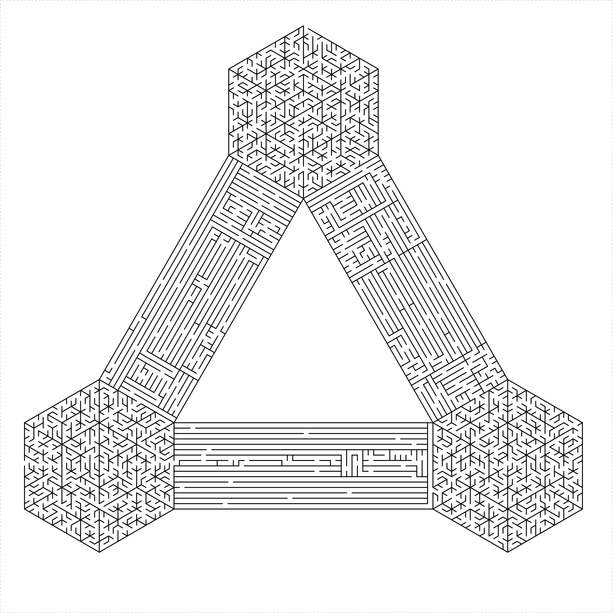


```r
library(TurtleGraphics)
library(mazealls)
# tiling!
tile_bit <- function(unit_len, depth, clockwise = TRUE, 
    draw_boundary = FALSE, boundary_holes = NULL) {
    turtle_col("black")
    parallelogram_maze(unit_len = unit_len, height = 2^depth, 
        clockwise = clockwise, draw_boundary = TRUE, 
        num_boundary_holes = 4)
    turtle_col("red")
    for (iii in c(1:4)) {
        turtle_forward(unit_len * 2^(depth - 1))
        turtle_right(90)
        turtle_forward(unit_len * 2^(depth - 1))
        eq_triangle_maze(unit_len = unit_len, depth = depth, 
            clockwise = !clockwise, draw_boundary = draw_boundary, 
            boundary_lines = ifelse(iii <= 2, 2, 3), 
            num_boundary_holes = 3, end_side = ifelse(iii == 
                4, 2, 1))
        if (iii == 2) {
            turtle_col("blue")
        }
    }
    turtle_col("black")
    if (draw_boundary) {
        blines <- c(1, 2, 4)
    } else {
        blines = 1
    }
    parallelogram_maze(unit_len = unit_len, height = 2^depth, 
        clockwise = clockwise, draw_boundary = TRUE, 
        boundary_lines = blines, boundary_holes = blines, 
        end_side = 3)
    turtle_forward(unit_len * 2^(depth - 1))
    turtle_left(60)
    turtle_forward(unit_len * 2^(depth - 1))
}

turtle_init(2500, 2500, mode = "clip")
turtle_up()
turtle_hide()

x0 <- 220
y0 <- 0
ul <- 20
dep <- 5
turtle_do({
    for (jjj in c(1:5)) {
        turtle_setpos(x = x0, y = y0)
        turtle_setangle(angle = 0)
        replicate(5, tile_bit(unit_len = ul, depth = dep, 
            draw_boundary = TRUE))
        x0 <- x0 + ul * (2^dep) * (1 + sqrt(3)/2)
        y0 <- y0 + ul * (2^(dep - 1))
    }
})
```

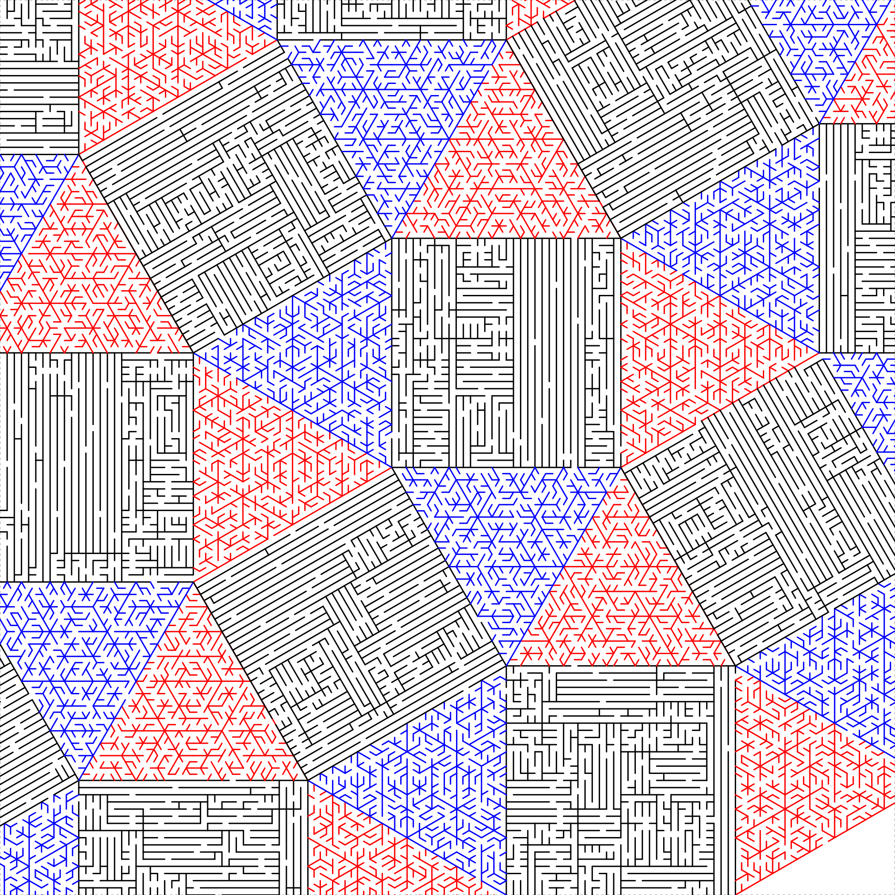

# Fun

Or whatever you call it. Here are some mazes built using the primitives.

## A dumb looking tree

Like it says on the label.


```r
library(TurtleGraphics)
library(mazealls)
treeit <- function(unit_len, depth, height, left_shrink = 3/4, 
    right_shrink = 1/3) {
    height <- ceiling(height)
    parallelogram_maze(unit_len = unit_len, height = 2^depth, 
        width = height, clockwise = TRUE, draw_boundary = TRUE, 
        boundary_lines = c(1, 2, 4), start_from = "midpoint", 
        boundary_holes = c(1), end_side = 3)
    if (depth > 0) {
        iso_trapezoid_maze(depth = depth - 1, unit_len = unit_len, 
            clockwise = FALSE, draw_boundary = TRUE, 
            boundary_lines = c(1, 3), start_from = "midpoint", 
            boundary_holes = c(1), end_side = 4)
        treeit(unit_len = unit_len, depth = depth - 
            1, height = left_shrink * height, left_shrink = left_shrink, 
            right_shrink = right_shrink)
        turtle_right(180)
        turtle_forward(unit_len * 2^(depth - 2))
        turtle_right(60)
        turtle_forward(unit_len * 2^(depth - 1))
        turtle_right(60)
        turtle_forward(unit_len * 2^(depth - 2))
        turtle_right(180)
        treeit(unit_len = unit_len, depth = depth - 
            1, height = right_shrink * height, left_shrink = left_shrink, 
            right_shrink = right_shrink)
        turtle_forward(unit_len * 2^(depth - 2))
        turtle_left(60)
        turtle_forward(unit_len * 2^(depth - 2))
        turtle_left(90)
        turtle_forward(unit_len * sqrt(3) * 2^(depth - 
            2))
        turtle_left(90)
    }
    turtle_right(90)
    turtle_forward(unit_len * height)
    turtle_right(90)
}

turtle_init(2500, 2500, mode = "clip")
turtle_up()
turtle_hide()
turtle_do({
    turtle_setpos(1600, 20)
    turtle_setangle(270)
    treeit(unit_len = 13, depth = 5, height = 70, left_shrink = 2/3, 
        right_shrink = 1/3)
})
```

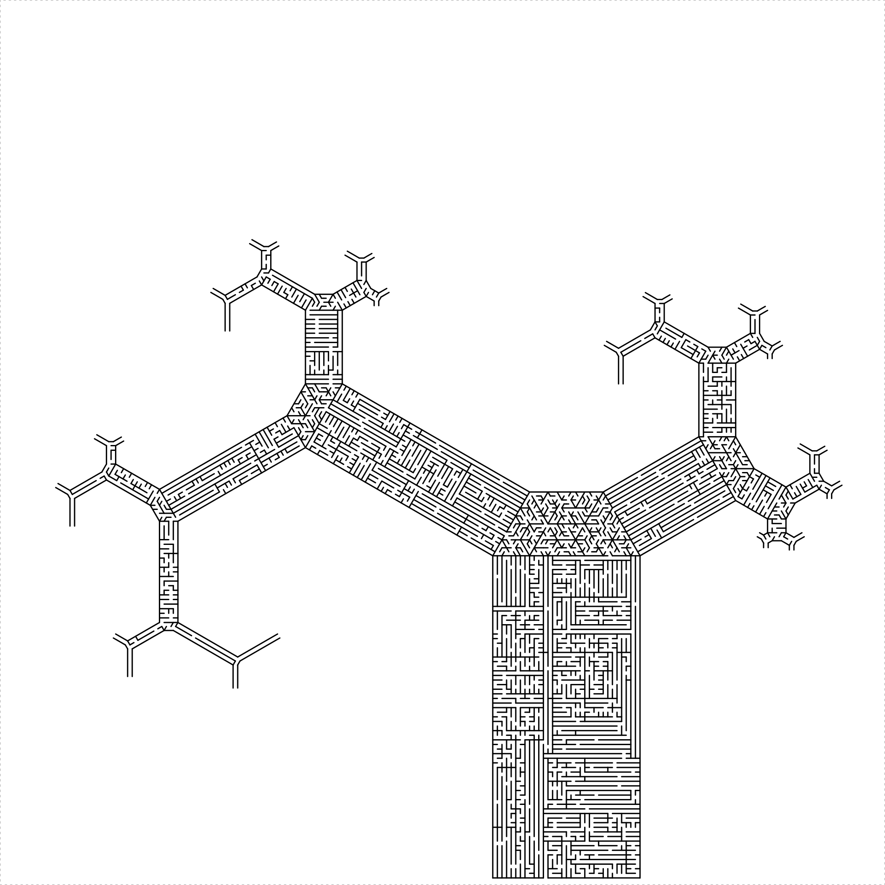

## A hex spiral


```r
turtle_init(2500, 2500, mode = "clip")
turtle_up()
turtle_hide()
della <- -3
lens <- seq(from = 120, to = 2 - della, by = della)

ulen <- 10
high <- 14
turtle_do({
    turtle_setpos(260, 570)
    turtle_setangle(270)
    for (iter in seq_along(lens)) {
        parallelogram_maze(unit_len = ulen, height = high, 
            width = lens[iter], start_from = "corner", 
            clockwise = TRUE, draw_boundary = TRUE, 
            boundary_holes = c(1, 3), end_side = 3)
        eq_triangle_maze(unit_len = ulen, depth = log2(high), 
            start_from = "corner", clockwise = FALSE, 
            draw_boundary = TRUE, boundary_lines = c(3), 
            num_boundary_holes = 0, boundary_holes = rep(FALSE, 
                3), end_side = 2)
    }
    parallelogram_maze(unit_len = ulen, height = high, 
        width = lens[iter] + della, start_from = "corner", 
        clockwise = TRUE, draw_boundary = TRUE, boundary_holes = c(1, 
            3), end_side = 3)
})
```

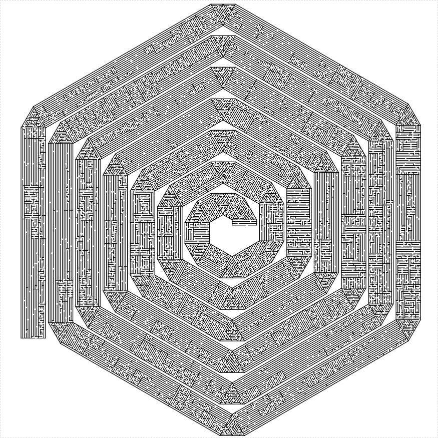


## A rectangular spiral

Well, a rhombus spiral.


```r
rect_spiral <- function(unit_len, height, width, thickness = 8L, 
    angle = 90, clockwise = TRUE, start_hole = FALSE) {
    if (start_hole) {
        bholes <- 1
        fourl_dist <- height - thickness
    } else {
        bholes <- 4
        fourl_dist <- height
    }
    
    last_one <- (width < thickness)
    if (last_one) {
        blines <- 1:4
        bholes <- c(3, bholes)
    } else {
        blines <- c(1, 2, 4)
    }
    blocs <- -sample.int(n = thickness, size = 4, replace = TRUE)
    
    parallelogram_maze(unit_len = unit_len, height = thickness, 
        width = fourl_dist, angle = 180 - angle, start_from = "corner", 
        clockwise = clockwise, draw_boundary = TRUE, 
        boundary_lines = blines, boundary_holes = bholes, 
        boundary_hole_locations = blocs, end_side = 3)
    if (clockwise) {
        turtle_left(angle)
    } else {
        turtle_right(angle)
    }
    
    if (!last_one) {
        rect_spiral(unit_len, height = width, width = height - 
            thickness, thickness = thickness, angle = 180 - 
            angle, clockwise = clockwise, start_hole = FALSE)
    }
}

turtle_init(2500, 2500, mode = "clip")
turtle_up()
turtle_hide()
turtle_do({
    turtle_setpos(300, 50)
    turtle_setangle(270)
    rect_spiral(unit_len = 20, 110, 90, thickness = 15, 
        angle = 80, start_hole = TRUE)
})
```

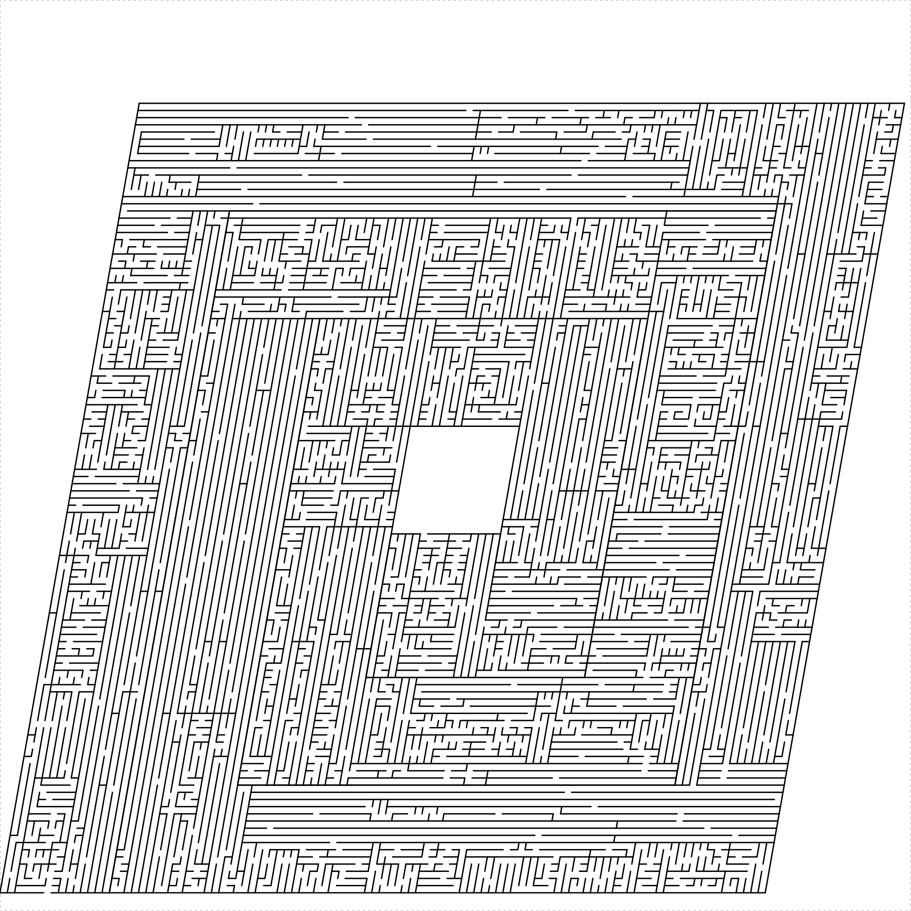


## A double rectangular spiral

The path spirals in, then out, joining at the center. This might be buggy.


```r
double_spiral <- function(unit_len, height, width, 
    thickness = 8L, angle = 90, clockwise = TRUE, start_hole = TRUE, 
    color1 = "black", color2 = "black") {
    len1 <- height - thickness
    bline1 <- c(1, 2, 4)
    bline2 <- c(1, 3, 4)
    bhole1 <- c(2)
    if (start_hole) {
        len2 <- len1
        bline2 <- c(bline2, 2)
        bhole1 <- c(bhole1, 4)
    } else {
        len2 <- len1 - 2 * thickness
    }
    blocs1 <- -sample.int(n = thickness, size = 4, 
        replace = TRUE)
    blocs2 <- -sample.int(n = thickness, size = 4, 
        replace = TRUE)
    last_one <- (min(len1, len2) <= 0) || (width <= 
        2 * thickness)
    if (last_one) {
        bhole2 <- c(4)
    } else {
        bhole2 <- c(3)
    }
    if (start_hole) {
        bhole2 <- c(bhole2, 2)
    }
    second_stripe <- ((len2 > 0) && (width > thickness))
    
    if (len1 > 0) {
        turtle_col(color1)
        parallelogram_maze(unit_len = unit_len, height = len1, 
            width = thickness, angle = angle, start_from = "corner", 
            clockwise = clockwise, draw_boundary = TRUE, 
            boundary_lines = bline1, boundary_holes = bhole1, 
            boundary_hole_locations = blocs1, end_side = ifelse(len2 > 
                0, 3, 2))
        if (second_stripe) {
            wid2 <- min(thickness, width - thickness)
            turtle_col(color2)
            parallelogram_maze(unit_len = unit_len, 
                height = len2, width = wid2, angle = 180 - 
                  angle, start_from = "corner", clockwise = !clockwise, 
                draw_boundary = TRUE, boundary_lines = bline2, 
                boundary_holes = bhole2, boundary_hole_locations = blocs2, 
                end_side = 4)
            turtle_col(color1)
            
            turtle_forward(unit_len * (thickness + 
                wid2))
            if (clockwise) {
                turtle_right(180 - angle)
            } else {
                turtle_left(180 - angle)
            }
            turtle_forward(unit_len * thickness)
            if (clockwise) {
                turtle_right(angle)
            } else {
                turtle_left(angle)
            }
        }
    }
    next_height <- width
    next_width <- ifelse(start_hole, height, height - 
        2 * thickness)
    
    if (last_one) {
        if (second_stripe) {
            parallelogram_maze(unit_len = unit_len, 
                height = next_height, width = thickness, 
                start_from = "corner", angle = 180 - 
                  angle, clockwise = clockwise)
        } else {
            parallelogram_maze(unit_len = unit_len, 
                height = next_height, width = thickness, 
                start_from = "corner", angle = angle, 
                clockwise = !clockwise)
        }
    } else {
        double_spiral(unit_len, height = next_height, 
            width = next_width, thickness = thickness, 
            angle = 180 - angle, clockwise = clockwise, 
            start_hole = FALSE, color1 = color1, color2 = color2)
    }
}

turtle_init(2500, 2500, mode = "clip")
turtle_up()
turtle_hide()
turtle_do({
    turtle_setpos(300, 50)
    turtle_setangle(0)
    double_spiral(unit_len = 20, height = 100, width = 100, 
        thickness = 10, angle = 80, start_hole = TRUE, 
        color2 = "gray40")
})
```

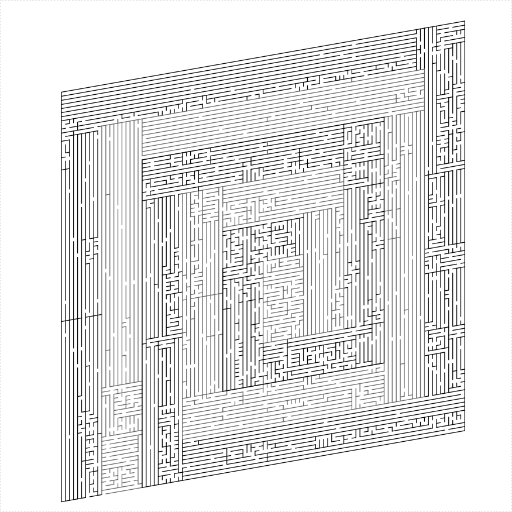


## A boustrophedon

As in ox that plods back and forth in a field.


```r
boustro <- function(unit_len, height, width, thickness = 8L, 
    angle = 90, clockwise = TRUE, start_hole = TRUE, 
    balance = 0) {
    if (start_hole) {
        bholes <- c(1, 3)
        blines <- 1:4
    } else {
        bholes <- c(1, 3)
        blines <- 2:4
    }
    
    last_one <- (width < thickness)
    blocs <- sample.int(n = thickness, size = 4, replace = TRUE)
    
    parallelogram_maze(unit_len = unit_len, height = height, 
        width = thickness, angle = angle, balance = balance, 
        start_from = "corner", clockwise = clockwise, 
        draw_boundary = TRUE, boundary_lines = blines, 
        boundary_holes = bholes, boundary_hole_locations = blocs, 
        end_side = 3)
    if (!last_one) {
        boustro(unit_len, height = height, width = width - 
            thickness, thickness = thickness, angle = 180 - 
            angle, clockwise = !clockwise, start_hole = FALSE, 
            balance = balance)
    }
}

turtle_init(2500, 2500, mode = "clip")
turtle_up()
turtle_hide()
turtle_do({
    turtle_setpos(100, 50)
    turtle_setangle(0)
    boustro(unit_len = 26, height = 82, width = 80, 
        thickness = 8, angle = 85, balance = 1.5)
})
```

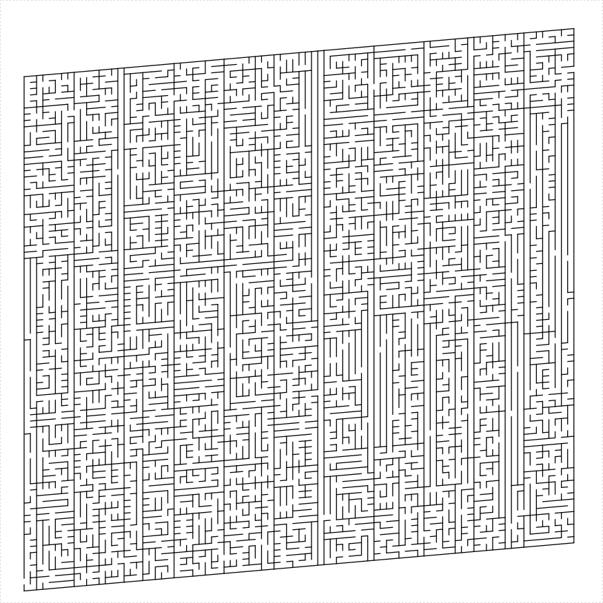
