# mazealls

[](https://travis-ci.org/shabbychef/mazealls)
[](http://codecov.io/github/shabbychef/mazealls?branch=master)
[](https://cran.r-project.org/package=mazealls)

> *Sometimes magic is just someone spending more time on something than anyone else might reasonably expect.* -- Teller
	

Generate mazes recursively via Turtle graphics. 

-- Steven E. Pav, shabbychef@gmail.com

## Installation

This package can be installed 
via [drat](https://github.com/eddelbuettel/drat "drat"), or
from github:


```r
# via drat:
if (require(drat)) {
    drat:::add("shabbychef")
    install.packages("mazealls")
}
# get snapshot from github (may be buggy)
if (require(devtools)) {
    install_github("shabbychef/mazealls")
}
```

# parallelogram maze

The simplest maze to generate recursively is a parallelogram. One can generate
a parallelogram maze by splitting the domain into two parts by an arbitrary
cut line with a hole in it, and then recursively creating mazes on both parts. 
Unlike some shapes, this method applies for arbitrary (integral) side lengths,
where by 'length' we mean in units of 'hallway widths', what we call the
`unit_len` in the API. Here is a simple parallelogram maze:


```r
library(TurtleGraphics)
library(mazealls)
turtle_init(1000, 1000)
turtle_up()
turtle_hide()
turtle_do({
    turtle_left(90)
    turtle_forward(distance = 400)
    turtle_right(90)
    parallelogram_maze(angle = 90, unit_len = 10, width = 75, 
        height = 55, method = "uniform", draw_boundary = TRUE)
})
```

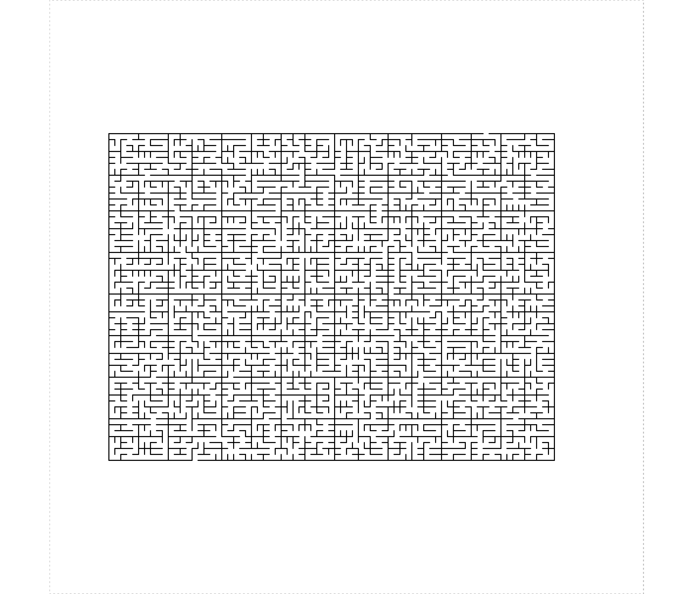

The `parallelogram_maze` function admits a `balance` parameter which controls
how the maze should be recursively subdivided. A negative value creates
imbalanced mazes, while positive values create more uniform mazes. In the
example below we create seven mazes side by side with an increasing balance
parameter:


```r
library(TurtleGraphics)
library(mazealls)
turtle_init(2000, 2000)
turtle_hide()
turtle_up()
turtle_do({
    turtle_left(90)
    turtle_forward(930)
    turtle_right(90)
    valseq <- seq(from = -1.5, to = 1.5, length.out = 7)
    blines <- c(1, 2, 3, 4)
    bholes <- c(1, 3)
    set.seed(1234)
    for (iii in seq_along(valseq)) {
        parallelogram_maze(angle = 90, unit_len = 12, 
            width = 22, height = 130, method = "two_parallelograms", 
            draw_boundary = TRUE, balance = valseq[iii], 
            end_side = 3, boundary_lines = blines, 
            boundary_holes = bholes)
        turtle_right(180)
        blines <- c(2, 3, 4)
        bholes <- c(3)
    }
})
```

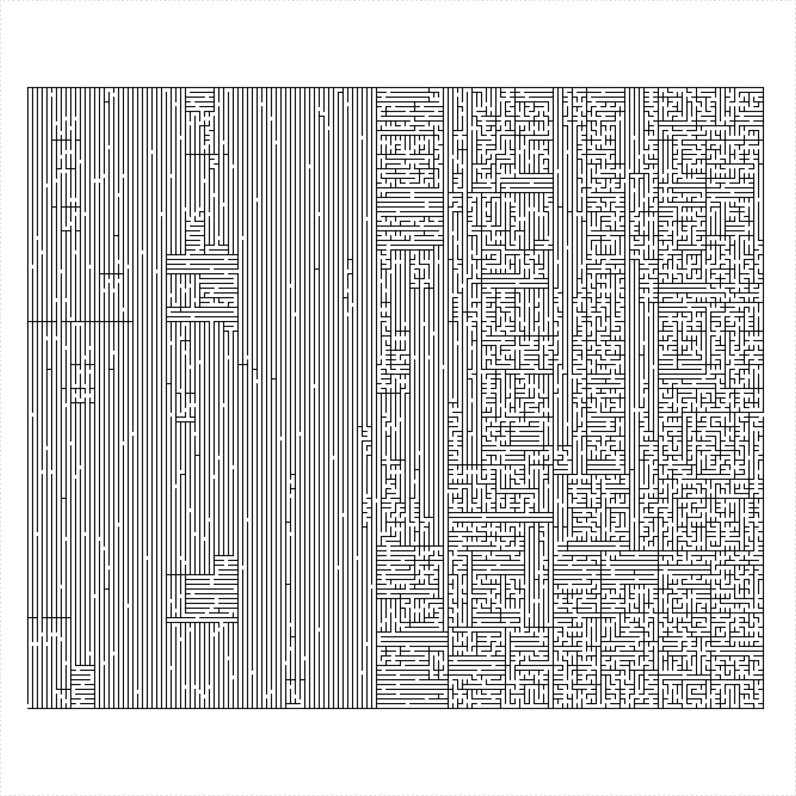

# triangle maze

An equilateral triangle maze can be constructed in a number of different ways:

1. Create four equilateral mazes with lines with holes between them. This
only works if the side length of the original is a power of two.
1. Cut out a parallelogram and attach two equilateral triangles.
Again only if the side length is a power of two.
1. Create an isosceles trapezoid maze, then stack an equilateral triangle
on top of it. This only works if the side length is even.
1. Create a regular hexagonal maze and three equilateral mazes in the corners.
This only works if the side length of the original triangle is divisible by
three.
1. Shave off a single hallway and create an equilateral triangular maze
of side length one less than the original.


I illustrate them here:


```r
library(TurtleGraphics)
library(mazealls)
# uniform method
turtle_init(1000, 1000)
turtle_up()
turtle_hide()
turtle_do({
    turtle_left(90)
    turtle_forward(distance = 300)
    turtle_right(90)
    eq_triangle_maze(depth = 6, unit_len = 12, method = "uniform", 
        draw_boundary = TRUE)
})
```

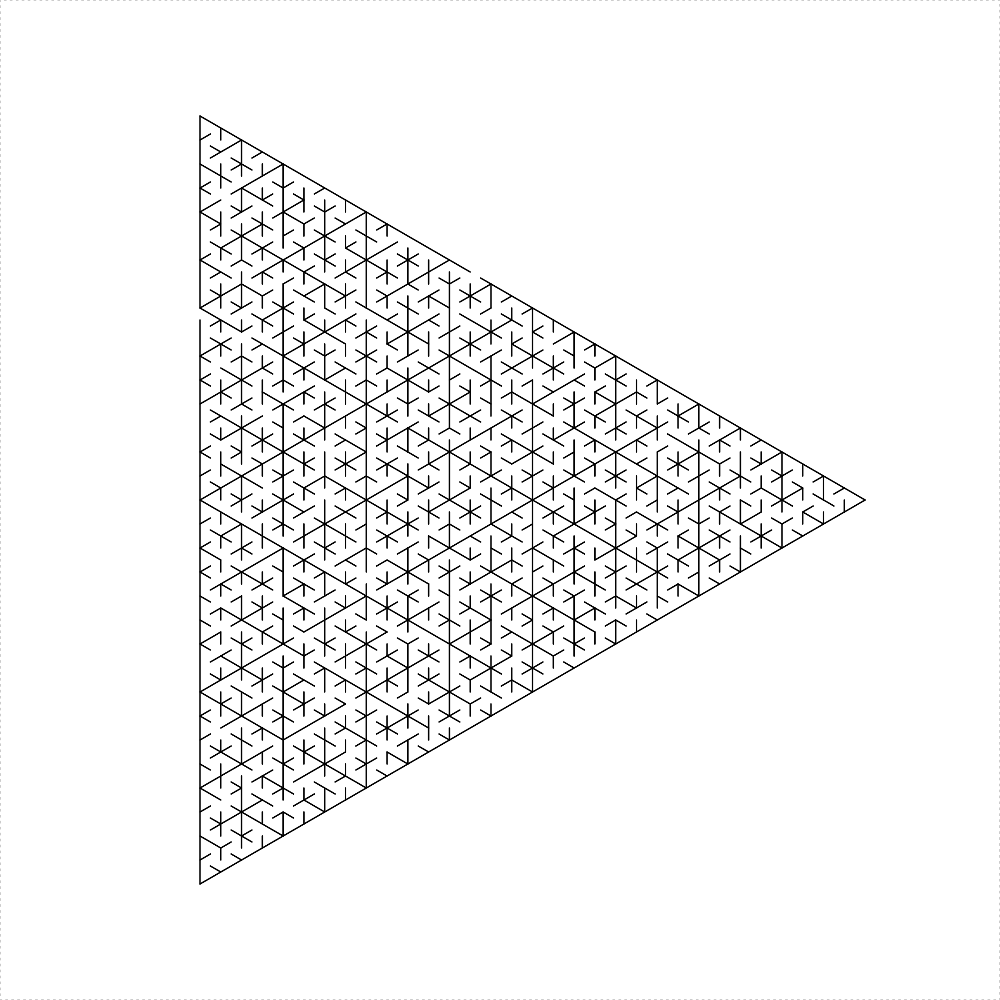


```r
library(TurtleGraphics)
library(mazealls)
# stacked trapezoids
turtle_init(1000, 1000)
turtle_up()
turtle_hide()
turtle_do({
    turtle_left(90)
    turtle_forward(distance = 300)
    turtle_right(90)
    eq_triangle_maze(depth = 6, unit_len = 12, method = "stack_trapezoids", 
        draw_boundary = TRUE)
})
```

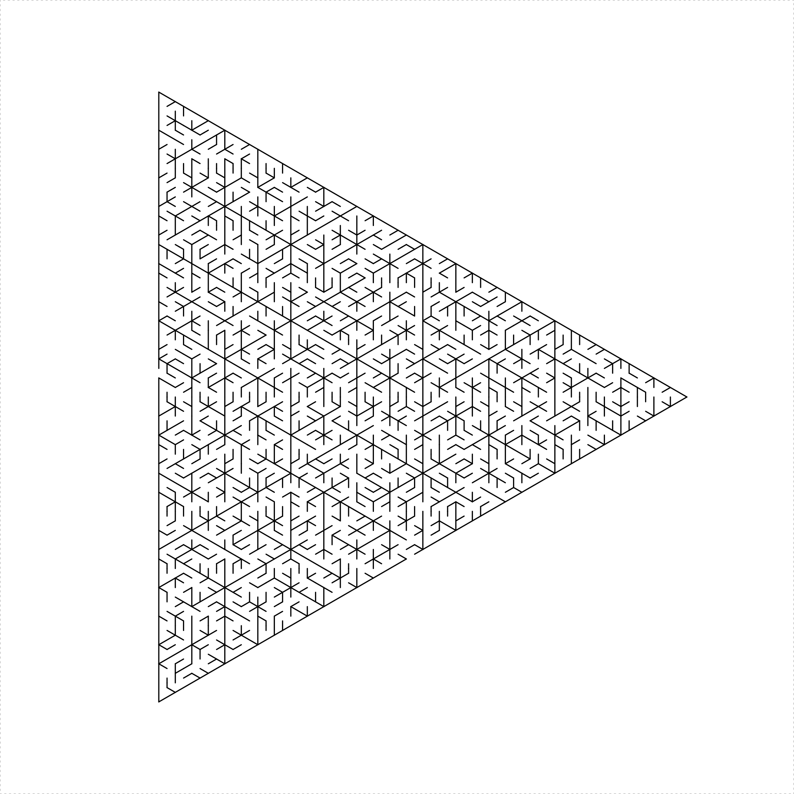


```r
library(TurtleGraphics)
library(mazealls)
# four triangles
turtle_init(1000, 1000)
turtle_up()
turtle_hide()
turtle_do({
    turtle_left(90)
    turtle_forward(distance = 300)
    turtle_right(90)
    eq_triangle_maze(depth = 6, unit_len = 12, method = "triangles", 
        draw_boundary = TRUE)
})
```

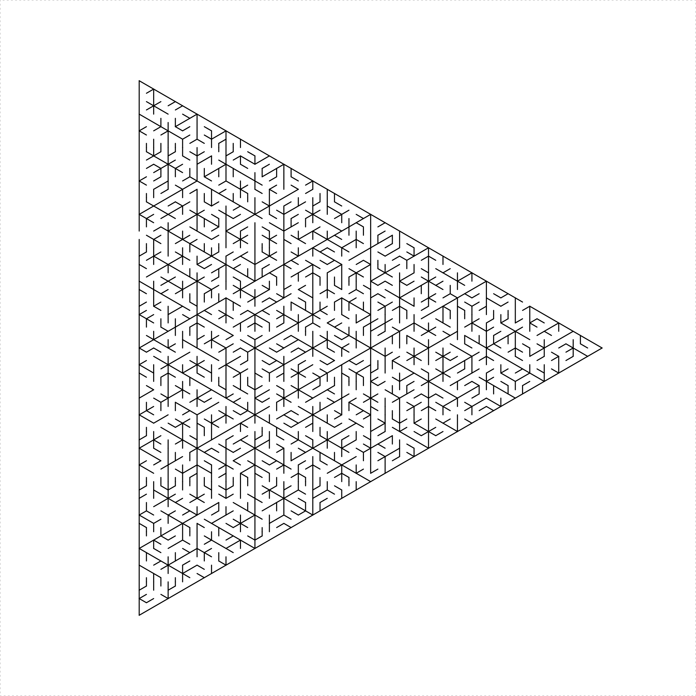

```r
library(TurtleGraphics)
library(mazealls)
# two ears
turtle_init(1000, 1000)
turtle_up()
turtle_hide()
turtle_do({
    turtle_left(90)
    turtle_forward(distance = 300)
    turtle_right(90)
    eq_triangle_maze(depth = 6, unit_len = 12, method = "two_ears", 
        draw_boundary = TRUE)
})
```

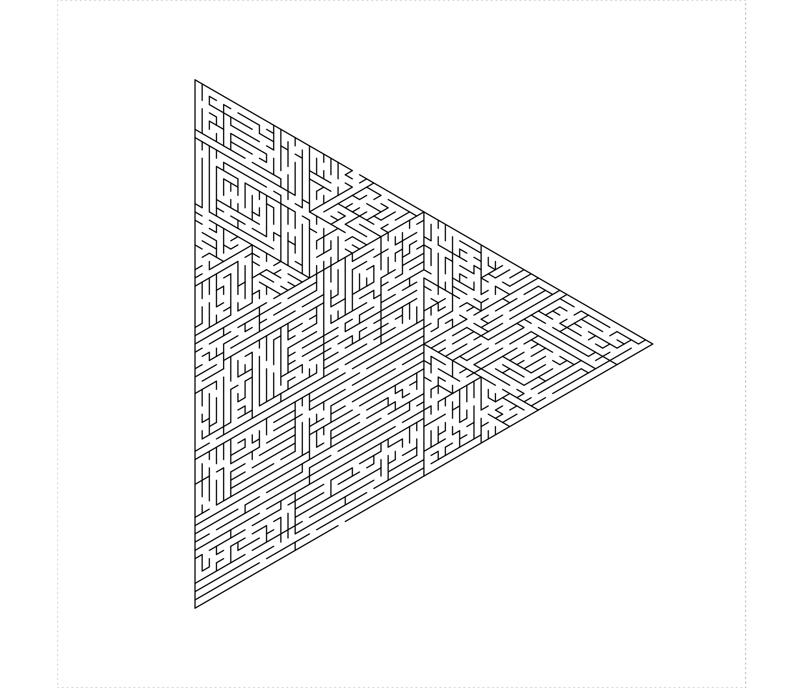


```r
library(TurtleGraphics)
library(mazealls)
# hex and three
turtle_init(1000, 1000)
turtle_up()
turtle_hide()
turtle_do({
    turtle_left(90)
    turtle_forward(distance = 300)
    turtle_right(90)
    eq_triangle_maze(depth = log2(66), unit_len = 12, 
        method = "hex_and_three", draw_boundary = TRUE)
})
```

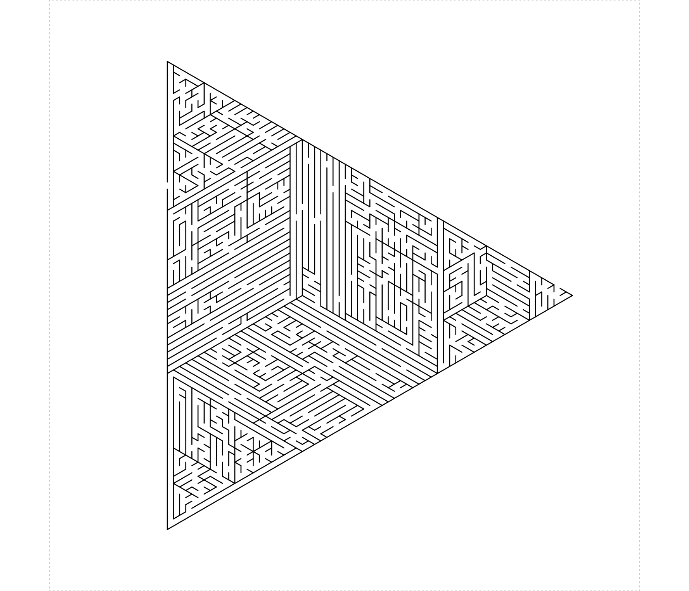


```r
library(TurtleGraphics)
library(mazealls)
# shave
turtle_init(1000, 1000)
turtle_up()
turtle_hide()
turtle_do({
    turtle_left(90)
    turtle_forward(distance = 300)
    turtle_right(90)
    eq_triangle_maze(depth = log2(66), unit_len = 12, 
        method = "shave", draw_boundary = TRUE)
})
```

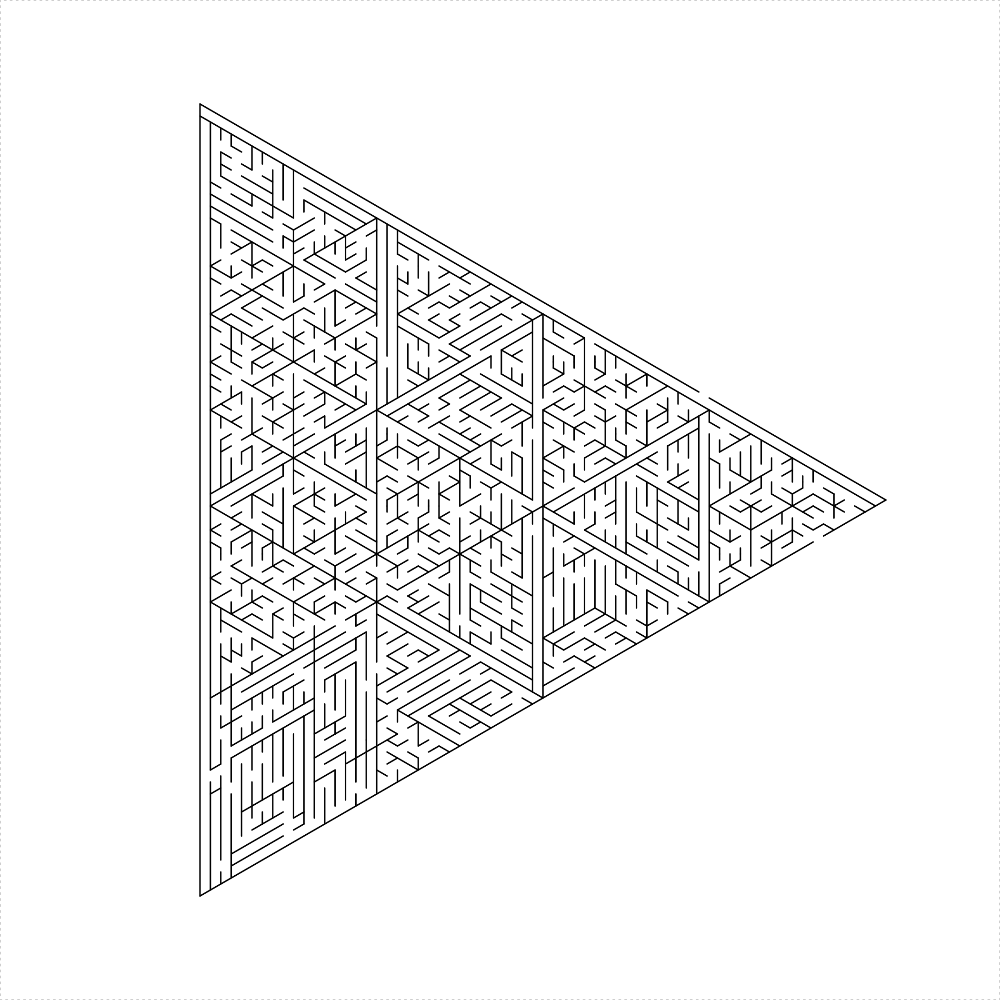


```r
library(TurtleGraphics)
library(mazealls)
# shave all
turtle_init(1000, 1000)
turtle_up()
turtle_hide()
turtle_do({
    turtle_left(90)
    turtle_forward(distance = 300)
    turtle_right(90)
    eq_triangle_maze(depth = log2(66), unit_len = 12, 
        method = "shave_all", draw_boundary = TRUE)
})
```

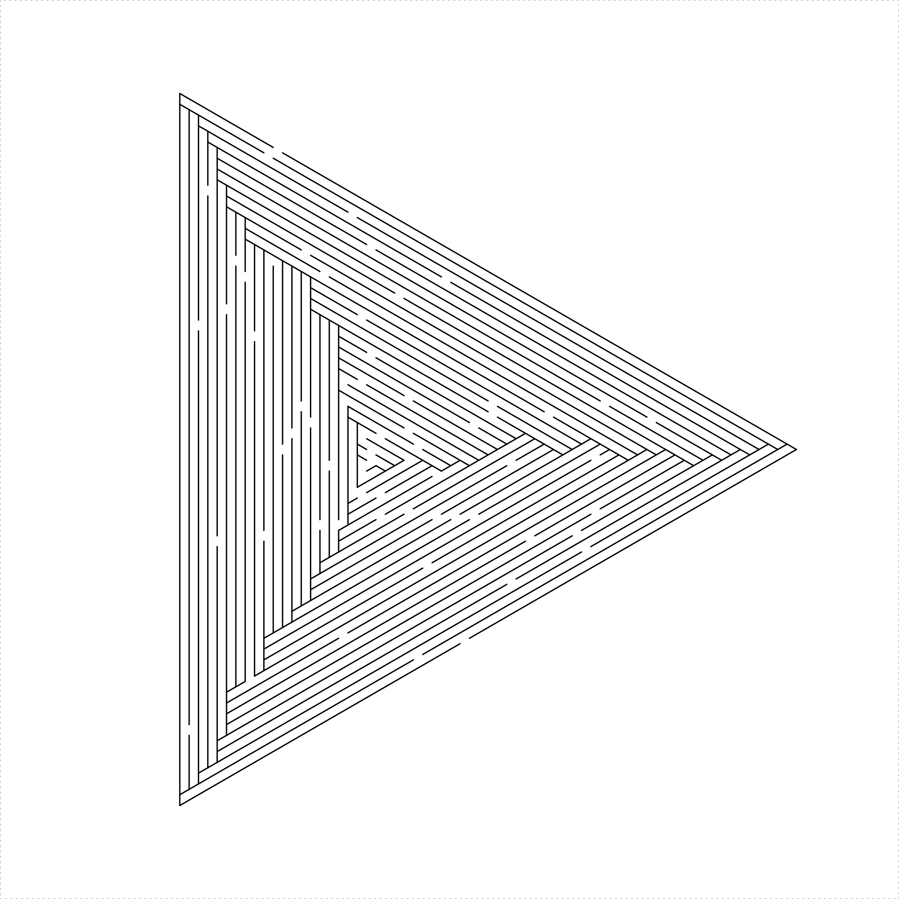

# hexagon maze


An regular hexagonal maze can be constructed in a number of different ways:

1. Decompose the hexagon as 6 equilateral triangle mazes, with one solid line
	 and five lines with holes dividing them.
1. Create two isosceles trapezoid mazes with long sides joined by a line with a
	 hole.
1. Create three parallelogram mazes with one solid line and two lines with
	 holes dividing them.


```r
library(TurtleGraphics)
library(mazealls)
# two trapezoids
turtle_init(1000, 1000)
turtle_up()
turtle_hide()
turtle_do({
    turtle_left(90)
    turtle_forward(distance = 300)
    turtle_right(90)
    hexagon_maze(depth = 5, unit_len = 12, method = "two_trapezoids", 
        draw_boundary = TRUE)
})
```

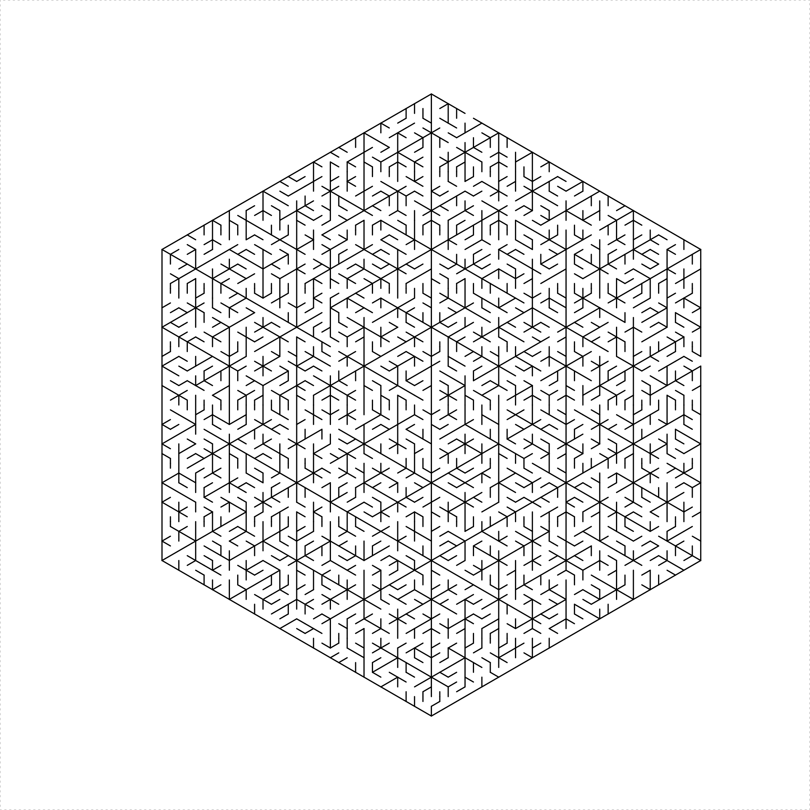


```r
library(TurtleGraphics)
library(mazealls)
# six triangles
turtle_init(1000, 1000)
turtle_up()
turtle_hide()
turtle_do({
    turtle_left(90)
    turtle_forward(distance = 300)
    turtle_right(90)
    hexagon_maze(depth = 5, unit_len = 12, method = "six_triangles", 
        draw_boundary = TRUE)
})
```

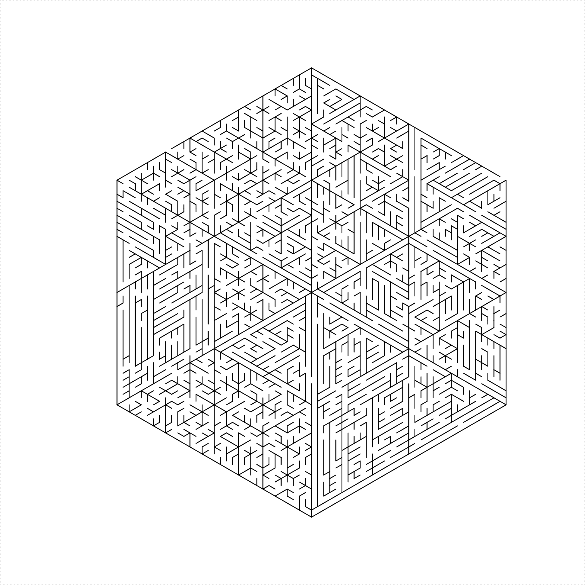


```r
library(TurtleGraphics)
library(mazealls)
# six triangles
turtle_init(1000, 1000)
turtle_up()
turtle_hide()
turtle_do({
    turtle_left(90)
    turtle_forward(distance = 300)
    turtle_right(90)
    hexagon_maze(depth = 5, unit_len = 12, method = "three_parallelograms", 
        draw_boundary = TRUE)
})
```

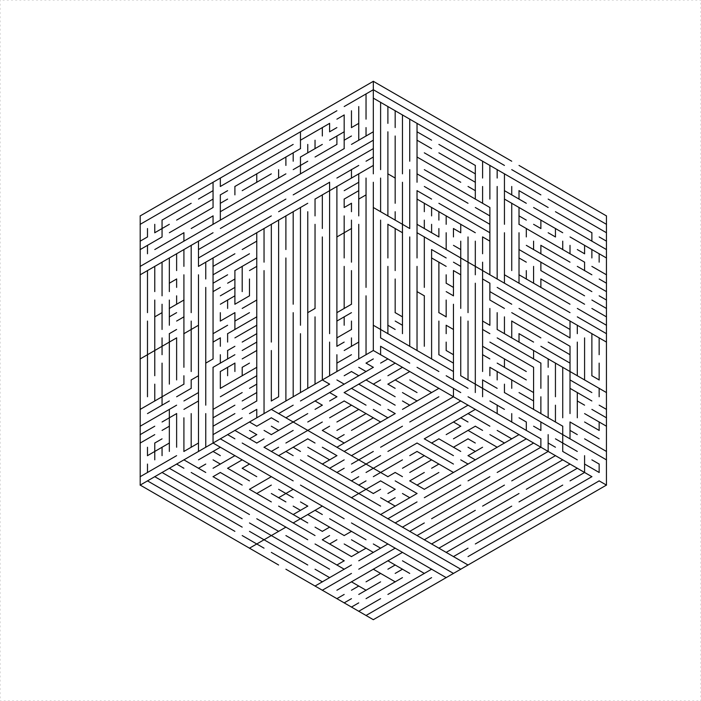


# trapezoid maze


An isosceles trapezoid maze can be constructed in a number of different ways:

1. Decompose as four trapezoidal mazes with a 'bone' shape between them
	 consisting of two solid lines and three lines with holes.
1. Decompose as a parallelogram and an equilateral triangle with a line
	 with holes between them


```r
library(TurtleGraphics)
library(mazealls)
# four trapezoids
turtle_init(1000, 1000)
turtle_up()
turtle_hide()
turtle_do({
    turtle_left(90)
    turtle_forward(distance = 300)
    turtle_right(90)
    iso_trapezoid_maze(depth = 5, unit_len = 12, method = "four_trapezoids", 
        draw_boundary = TRUE)
})
```

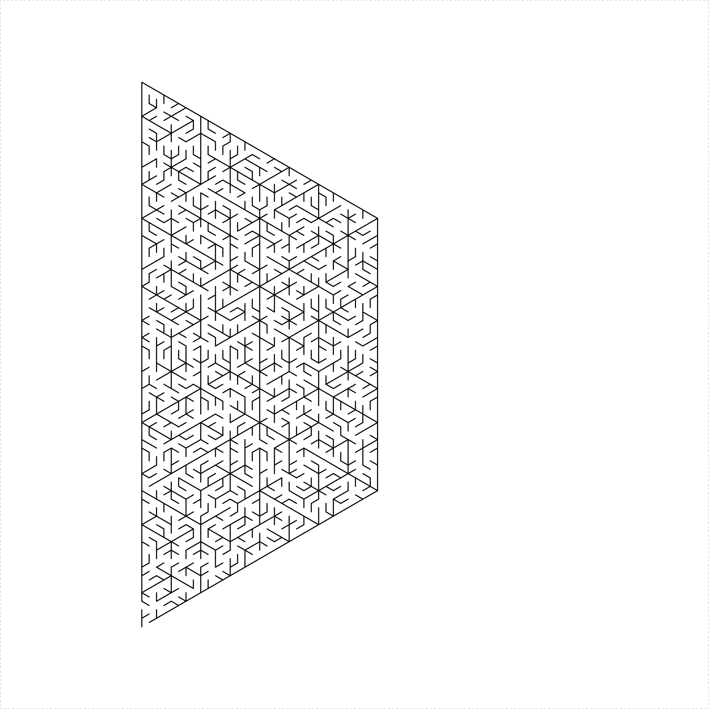


```r
library(TurtleGraphics)
library(mazealls)
# one ear
turtle_init(1000, 1000)
turtle_up()
turtle_hide()
turtle_do({
    turtle_left(90)
    turtle_forward(distance = 300)
    turtle_right(90)
    iso_trapezoid_maze(depth = 5, unit_len = 12, method = "one_ear", 
        draw_boundary = TRUE)
})
```

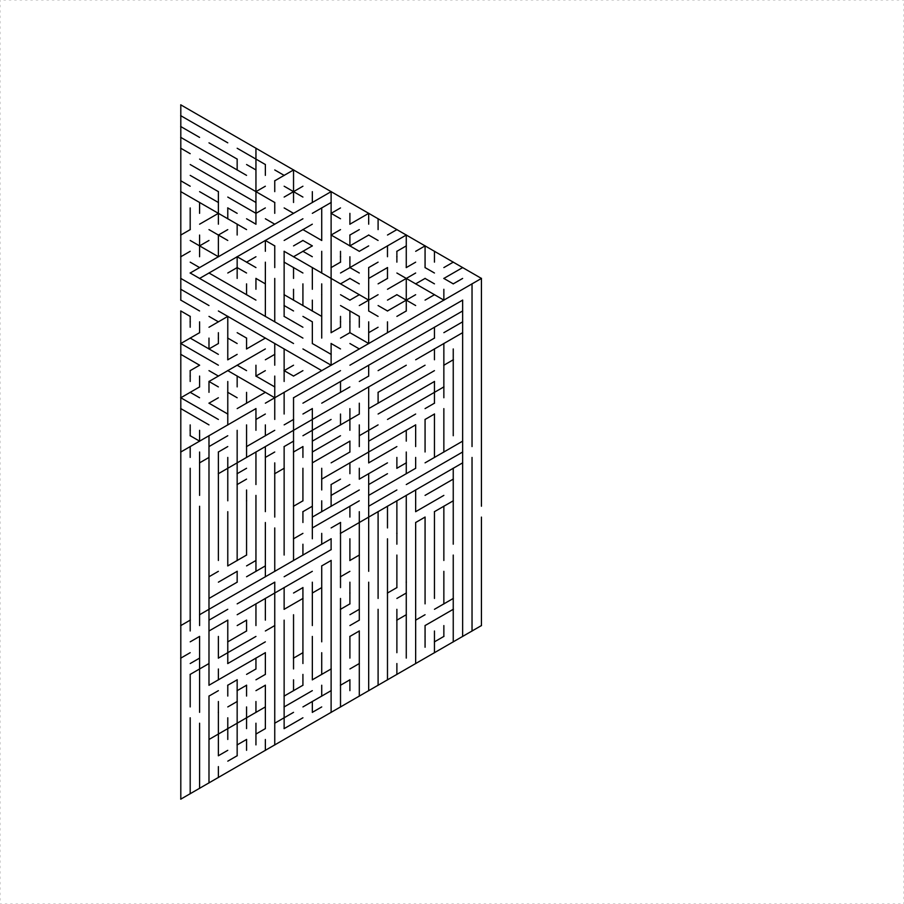

# Koch snowflake maze

Everyone's favorite snowflake can also be a maze. Simply fill in triangle bumps
with triangular mazes and create lines with holes as needed:


```r
library(TurtleGraphics)
library(mazealls)
# koch
turtle_init(1000, 1000)
turtle_up()
turtle_hide()
turtle_do({
    turtle_left(90)
    turtle_forward(distance = 200)
    turtle_right(90)
    turtle_backward(distance = 300)
    koch_maze(depth = 4, unit_len = 8)
})
```

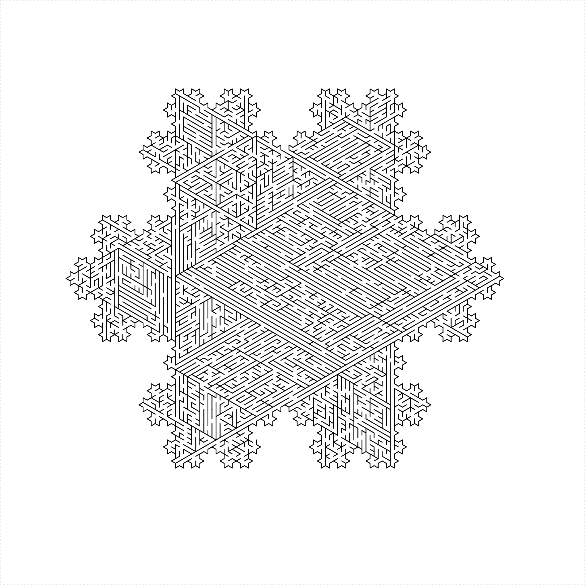
